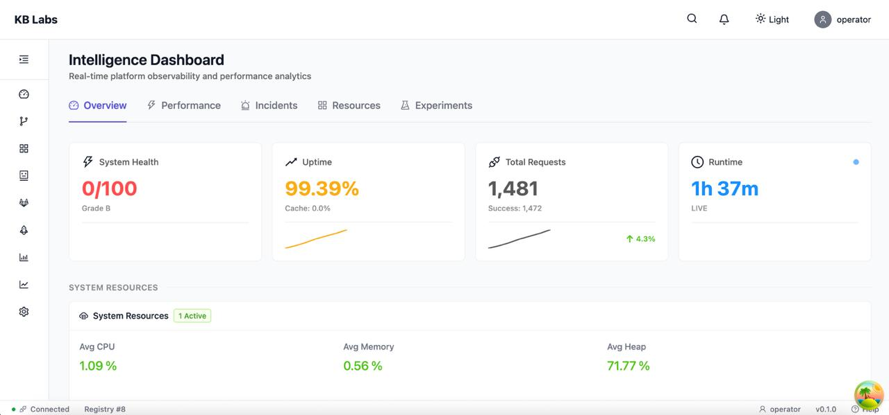
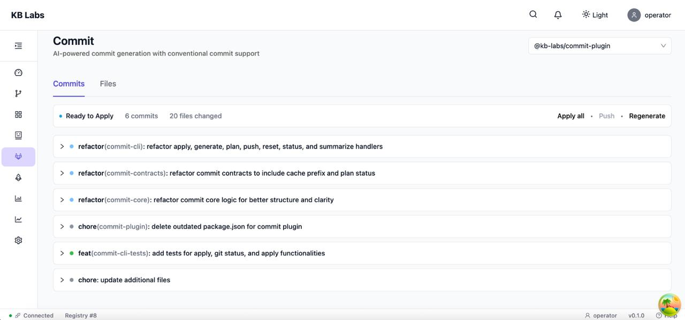
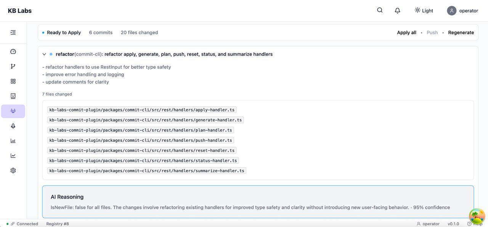
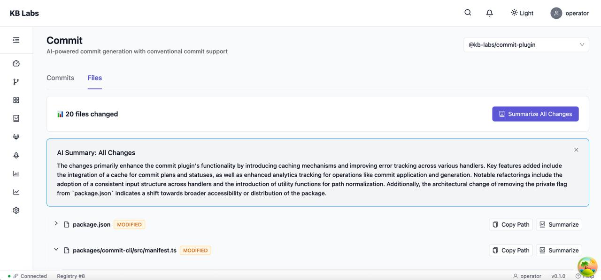
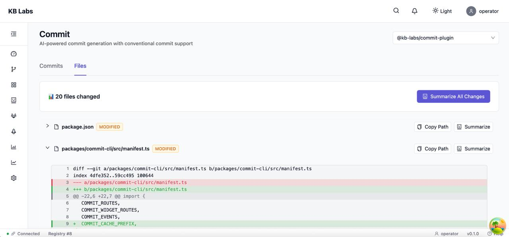
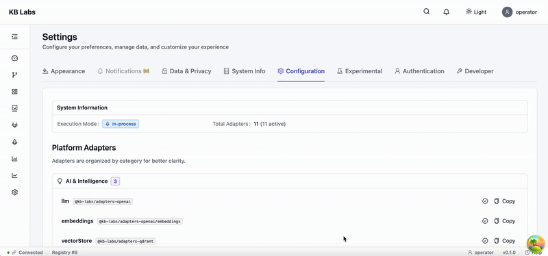

# KB Labs

> Internal Developer Platform with Zero Vendor Lock-In — swap any infrastructure component without code changes

**Status:** 🚧 Active Development | **License:** Dual (71% KB Public License v1.1, 29% MIT) | **Stage:** Private Beta

**TL;DR:** Adapter-first IDP where you can swap Redis → Memcached, PostgreSQL → MySQL, OpenAI → Anthropic in a config file. Built-in workflow engine, AI code search (Mind RAG), observability dashboard, and 18 DevKit tools for monorepo management. Not production-ready yet (Q2 2026 target), but actively developed with real working demos.

[](https://github.com/kb-labs/kb-labs)
[](https://github.com/kb-labs/kb-labs/discussions)
[](mailto:contact@kblabs.dev)

---

## Why You Should Care

**👔 For CTOs:**
- **Zero migration risk** — Swap infrastructure without code changes (Redis → Memcached, PostgreSQL → MySQL in a config file)
- **Progressive scaling** — Start at $0, scale to enterprise without rewrites ($0 → $100 → $1K+/month, same codebase)
- **No vendor lock-in** — Own your architectural choices, change your mind later without penalty

**🛠️ For Engineering Managers:**
- **18 DevKit tools** — Monorepo health checks, dependency auto-fixing, build order calculation, type safety audits
  - ⚡ **10-50x faster** than manual migration (automated path updates, import rewrites, config synchronization)
  - ⏱️ **Saves 2-3 hours/week** per developer (automated health checks vs manual validation)
  - 🔧 **Single command** to fix 90% of common issues (unused deps, broken imports, duplicate versions)
- **Type safety** — 93.9% type coverage across 79 packages, find all 2,041 type errors in one command
- **Engineering culture** — ADRs, best practices, documented trade-offs, production-ready patterns

**👨‍💻 For Developers:**
- **Fast iteration** — Hot reload, clear errors, good debugging, no magic
- **AI-powered tools** — Semantic code search (Mind RAG), LLM commit generation (99% cheaper than Copilot), release automation
- **Plugin ecosystem** — Extend capabilities without forking, marketplace-ready architecture

---

## Table of Contents

- [Why KB Labs](#why-kb-labs)
- [What KB Labs Is (and Is Not)](#what-kb-labs-is-and-is-not)
- [Core Concepts](#core-concepts)
- [Architecture Overview](#architecture-overview)
- [Core Components](#core-components)
- [Use Cases](#use-cases)
- [Demo](#demo)
  - [Infrastructure Swap in 30 Seconds](#1-infrastructure-swap-in-30-seconds)
  - [Mind RAG: AI Code Search](#2-mind-rag-ai-code-search-with-auto-escalation)
  - [LLM-Powered Commits (99% Cheaper)](#3-llm-powered-commits-99-cheaper)
  - [DevKit: Monorepo Health Check](#4-devkit-monorepo-health-check)
  - [Platform in Action: Real Screenshots](#platform-in-action-real-screenshots)
- [Project Status](#project-status)
- [Roadmap (High-Level)](#roadmap-high-level)
  - [Near-Term (Q1-Q2 2026)](#near-term-q1-q2-2026---stabilization--hardening)
  - [Mid-Term (Q3-Q4 2026)](#mid-term-q3-q4-2026---ecosystem-growth)
  - [Long-Term (2027+)](#long-term-2027---public-beta--enterprise-adoption)
- [Philosophy & Principles](#philosophy--principles)
  - [Open the Closed](#open-the-closed)
  - [Design Principles](#design-principles)
  - [Engineering Values](#engineering-values)
  - [Trade-Offs We've Made](#trade-offs-weve-made)
  - [Why This Matters](#why-this-matters)
- [Documentation](#documentation)
- [Contributing](#contributing)
- [License](#license)

---

## Why KB Labs

**The Problem:**

Modern development platforms force you into architectural decisions that become expensive to change:

- **Vendor lock-in** — Switching from PostgreSQL to MySQL? Redis to Memcached? Prometheus to Datadog? Each requires code changes across the entire system
- **Rigid infrastructure** — LLM provider, vector database, metrics backend are hard-coded into the platform
- **All-or-nothing adoption** — Can't replace just one piece without forking the entire codebase
- **High switching costs** — What starts as "it's just Postgres" becomes "we can't migrate without rewriting 50% of the code"

**Why existing tools fall short:**

| Platform | Problem |
|----------|---------|
| **Temporal** | Hard-coded to PostgreSQL/Cassandra. Want MySQL? Fork the codebase. |
| **Backstage** | Tightly coupled to specific integrations. Custom analytics? Rewrite plugins. |
| **Internal tools** | Built for today's requirements. Tomorrow's needs require rewrites. |

**What KB Labs addresses:**

- **Adapter-first architecture** — Every infrastructure dependency (cache, DB, logger, metrics, LLM, vector store) is a swappable adapter
- **No vendor lock-in** — Change Redis → Memcached, OpenAI → Anthropic, Prometheus → Datadog in a config file
- **Future-proof** — New requirements don't require code changes, just new adapters
- **Pay for what you need** — Use free InMemory cache in dev, Redis in staging, AWS ElastiCache in production

---

## How KB Labs Compares

| Feature | KB Labs | Temporal | Backstage | n8n |
|---------|---------|----------|-----------|-----|
| **Adapter-first** | ✅ All infrastructure | ❌ Locked to Cassandra/PostgreSQL | ❌ Hard-coded integrations | ⚠️ Partial |
| **Workflow Engine** | ✅ DAG-based | ✅ Full-featured | ❌ No | ✅ Visual builder |
| **Developer Portal** | ✅ Built-in (Studio UI) | ❌ No | ✅ Full portal | ❌ No |
| **Plugin System** | ✅ Extensible | ⚠️ Limited | ✅ Plugin-based | ✅ Nodes |
| **AI Integration** | ✅ Built-in (Mind RAG) | ❌ No | ❌ No | ⚠️ Via plugins |
| **DevKit Tools** | ✅ 18 monorepo tools | ❌ No | ⚠️ Basic | ❌ No |
| **Self-hosted** | ✅ Free | ✅ OSS | ✅ OSS | ✅ OSS |
| **Production Ready** | ⚠️ Q2 2026 | ✅ Yes | ✅ Yes | ✅ Yes |

**Key Differentiator:** KB Labs is the only platform where you can swap **every** infrastructure component (cache, DB, LLM, vector store, metrics, logger) in a config file. No code changes, no vendor lock-in.

---

## What KB Labs Is (and Is Not)

### What It Is
- Adapter-first platform where ALL infrastructure is pluggable
- Workflow engine for complex DAG-based automation
- Developer portal with observability, analytics, and real-time monitoring
- Plugin system for extending capabilities (AI search, DevKit tools, analytics)
- Multi-tenant by design (free tier → enterprise scale)

### What It Is Not
- Not another Backstage clone (no hard-coded integrations)
- Not a workflow-only tool like Temporal (it's a full IDP)
- Not production-ready yet (active development, Q2 2026 target)
- Not trying to replace your entire stack (works alongside existing tools)

---

## Core Concepts

**Big Tech DX, Startup Budget**

KB Labs brings enterprise-grade developer experience to teams of any size — without enterprise budgets or infrastructure teams.

**Adapter-First Architecture**

Every infrastructure dependency is an interface. Swap Redis for Memcached, PostgreSQL for MySQL, OpenAI for Anthropic — all in a config file. No code changes. No vendor lock-in.

**Automation for Everyone**

Plugin system extends beyond dev tools. Workflows, analytics, observability — even business automation (analytics for PMs, compliance workflows for legal, expense automation for finance). If it can be automated, there's (or will be) a plugin for it.

**Scale on Your Terms**

- **Development**: Run on laptop with InMemory adapters ($0/month)
- **Startup**: 3-node cluster, Redis, PostgreSQL (~$100/month)
- **Enterprise**: Auto-scaling, managed services, dedicated execution clusters (~$1K+/month)

Same codebase, different configs. Grow without rewrites.

---

## Architecture Overview

**Layered, Adapter-First Design**

```
┌─────────────────────────────────────────────────────────┐
│          Interfaces (CLI / REST API / Webhooks)         │
│  How users/systems interact with the platform           │
└────────────────────────┬────────────────────────────────┘
                         │
┌────────────────────────▼────────────────────────────────┐
│                   Core Platform                         │
│  • Plugin System        • Workflow Engine               │
│  • State Management     • Multi-Tenancy                 │
│  • Event Bus            • Security/Auth                 │
└────────────────────────┬────────────────────────────────┘
                         │
         ┌───────────────┴───────────────┐
         │                               │
┌────────▼──────────-┐        ┌──────────▼───────────────┐
│ Infrastructure     │        │   Execution Layer        │
│ Adapters           │        │   (Plugin Runtime)       │
│ (Your Choice)      │        │                          │
│                    │        │  • InProcess (dev)       │
│ ICache    ILogger  │        │  • Subprocess (prod)     │
│ IDatabase IMetrics │        │  • WorkerPool (scale)    │
│ ILLMProvider       │        │  • Remote (enterprise)   │
│ IVectorStore       │        │                          │
└────────────────────┘        └──────────────────────────┘
     Your infrastructure            Where code runs
```

**Key Architectural Principles:**

- **Separation of Concerns** — Interfaces, business logic, infrastructure, and execution are independent layers
- **Dependency Injection** — All infrastructure adapters injected at runtime via config, not hardcoded
- **Execution Flexibility** — Plugins execute in-process (dev), subprocess (prod isolation), worker pool (horizontal scale), or remote cluster (enterprise)
- **Universal Execution** — REST API handlers, CLI commands, workflows, background jobs — all use the same execution layer

> **Deep Dive:** See [ARCHITECTURE.md](./demo/ARCHITECTURE.md) for detailed diagrams, adapter interfaces, and scaling strategies

---

## Core Components

**Built-In Platform Capabilities**

### Workflow Engine
DAG-based orchestration for complex automation — job scheduling, dependency resolution, retry logic, distributed state coordination via Redis

### Observability & Analytics
Real-time system monitoring (CPU, memory, incidents), metrics collection (Prometheus-compatible), historical analytics, automated incident detection with root cause analysis

### Plugin System
Extensible architecture for adding capabilities — Mind RAG (AI code search), DevKit (monorepo tools), Commit (AI commits), Release (semantic releases), custom business automation

### Developer Portal (Studio)
React-based web UI for platform management — workflow visualization, system health dashboards, incident tracking, real-time metrics, plugin galleries

### DevKit
18 monorepo management tools — import/export analysis, duplicate detection, dependency auto-fixing, build order calculation, TypeScript types audit, CI health checks

---

## Use Cases

**Real-World Scenarios**

### AI-Powered Commit Generation (Built-In Plugin)

**Problem:** Developers spend time writing commit messages, often inconsistent or too vague. Manual conventional commits are tedious.

**Solution:** Commit plugin analyzes `git diff` and `git status` using LLM, generates conventional commits (`feat`, `fix`, `refactor`) with proper scope and descriptions. Two-phase analysis escalates to full diff when confidence is low. Secrets detection prevents leaking API keys.

**Outcome:**
- ✅ Consistent, conventional commits across the team
- ⏱️ **Saves ~15 min/day per developer** (vs manual commit messages)
- 💰 **99% cheaper than GitHub Copilot** (~$0.01 per batch vs $20/month subscription)
- 📊 Enables automatic changelog generation and semantic versioning
- 🔒 Zero accidental secrets leaks (built-in detection)

---

### Automated Release Management (Built-In Plugin)

**Problem:** Manual semantic versioning is error-prone. Changelog generation, git tagging, npm publishing, GitHub releases — too many manual steps, easy to forget or mess up.

**Solution:** Release Manager plugin automates the entire release workflow — parses conventional commits, determines version bump (major/minor/patch), generates changelog from commits, creates git tag, publishes to npm, creates GitHub release with notes. All in one command.

**Outcome:**
- ✅ Zero manual steps from commit → npm publish
- ⏱️ **Release time: 30s vs 15 min manual** (30x faster)
- 🔒 **Zero human errors** in versioning, tagging, changelog
- 📈 Faster release cycles (from weekly to daily releases)
- 📝 Always up-to-date changelog with proper semantic versioning

---

### ClickUp Task Sync for Product Teams (Hypothetical Plugin)

**Problem:** Engineering work happens in GitHub/Git, but PMs track progress in ClickUp. Manual status updates waste time and get out of sync. No single source of truth.

**Solution:** Custom ClickUp plugin syncs workflow runs with ClickUp tasks — monitors workflow events via platform event bus, maps workflow IDs to ClickUp task IDs, auto-updates task status (In Progress → Testing → Done) based on workflow state. Uses adapter pattern for ClickUp API client.

**Outcome:**
- ✅ PMs see real-time engineering progress without manual status updates
- ⏱️ **Saves ~2 hours/week per developer** (no more "update the ticket" reminders)
- 📊 **Automatic cycle time metrics** from code → deployment visible in both systems
- 🔄 Single source of truth (Git drives ClickUp, not the other way around)
- 🤝 Better PM-Engineering collaboration (no more "is this done yet?" messages)

---

## Demo

> **Note:** KB Labs is in active development. These examples demonstrate current capabilities, not a finalized product.
>
> **Screenshots:** Real screenshots from KB Labs platform are available in [`docs/screenshots/`](./docs/screenshots/README.md)

### 1. Infrastructure Swap in 30 Seconds

**Problem:** Need to switch from Redis to in-memory cache for local development?

**Solution:** Edit one line in `.kb/kb.config.json`:

```diff
{
  "platform": {
    "adapters": {
-     "cache": "@kb-labs/adapters-redis"
+     "cache": "@kb-labs/adapters-memory"
    },
    "adapterOptions": {
-     "cache": {
-       "url": "redis://localhost:6379"
-     }
+     "cache": {}
    }
  }
}
```

**Result:** Restart your CLI. No code changes, no npm installs, no environment variables. Just config.

**Other common swaps:**
- **Database:** SQLite → PostgreSQL (change `adapters.db` + `adapterOptions.db`)
- **Vector Store:** Local → Qdrant (change `adapters.vectorStore` + `adapterOptions.vectorStore`)
- **LLM Provider:** OpenAI → Anthropic (change `adapters.llm` + `adapterOptions.llm`)
- **Logger:** Pino → Winston (change `adapters.logger`)

**Development → Startup → Enterprise, same codebase:**
```json
// Development ($0/month)
{
  "adapters": {
    "cache": "@kb-labs/adapters-memory",
    "db": "@kb-labs/adapters-sqlite",
    "vectorStore": "@kb-labs/adapters-local",
    "logger": "@kb-labs/adapters-console"
  }
}

// Startup (~$100/month)
{
  "adapters": {
    "cache": "@kb-labs/adapters-redis",
    "db": "@kb-labs/adapters-postgres",
    "vectorStore": "@kb-labs/adapters-qdrant",
    "logger": "@kb-labs/adapters-pino"
  }
}

// Enterprise (~$1K+/month)
{
  "adapters": {
    "cache": "@kb-labs/adapters-redis",
    "db": "@kb-labs/adapters-postgres",
    "vectorStore": "@kb-labs/adapters-qdrant",
    "logger": "@kb-labs/adapters-datadog",
    "metrics": "@kb-labs/adapters-prometheus"
  }
}
```

---

### 2. Mind RAG: AI Code Search with Auto-Escalation

**Problem:** "Where is the authentication logic implemented?"

**Traditional approach:**
```bash
# Grep through thousands of files
grep -r "authentication" src/
# Returns 500+ matches, most irrelevant
```

**KB Labs Mind RAG:**
```bash
pnpm kb mind rag-query --text "Where is authentication implemented?" --agent
```

**Output:**
```json
{
  "answer": "Authentication is handled by AuthService in packages/auth/src/auth-service.ts:42-156...",
  "confidence": 0.78,
  "sources": [
    "packages/auth/src/auth-service.ts:42-156",
    "packages/api/src/middleware/auth.ts:18-67"
  ],
  "mode": "auto"
}
```

**Why it's better:**
- **Semantic understanding** — Knows "authentication" = login, tokens, middleware, sessions
- **Confidence scores** — 0.78 = reliable (≥0.7 threshold)
- **Source verification** — Links directly to relevant code with line numbers
- **Anti-hallucination** — Verifies answers against actual codebase
- **Auto-escalation** — Automatically escalates query complexity if confidence is low
  - Starts with **instant** mode (fast, simple queries)
  - Escalates to **auto** mode if confidence < threshold (balanced analysis)
  - Escalates to **thinking** mode if still uncertain (deep multi-step reasoning)
  - You get the best answer without manual mode selection

**Query complexity examples:**
- **Simple lookup** → "What is VectorStore interface?" → instant mode (~5-10s)
- **Concept understanding** → "How does hybrid search work?" → auto mode (~10-30s)
- **Architecture analysis** → "Explain workflow orchestration flow" → thinking mode (~30-50s)

---

### 3. LLM-Powered Commits (99% Cheaper)

**Problem:** Writing meaningful commit messages is tedious and inconsistent.

**KB Labs commit plugin:**
```bash
# Stage your changes
git add .

# Generate commits with LLM
pnpm kb commit commit --scope="@kb-labs/workflow-runtime"
```

**Output:**
```
📝 Analyzing changes...
✅ Generated 3 commits:
   1. feat(workflow): add DAG validation for circular dependencies
   2. refactor(workflow): extract job executor to separate module
   3. chore(workflow): update dependencies

Apply commits? (y/n): y

✅ Applied commits:
  [ae96418] feat(workflow): add DAG validation for circular dependencies
  [cbd2ed6] refactor(workflow): extract job executor to separate module
  [7f23c9a] chore(workflow): update dependencies

┌─ Done ─────────────────────────┐
│ Summary                        │
│ Commits:  3                    │
│ Pushed:   No                   │
│ LLM:      Phase 2              │
│ Tokens:   4,832                │
│ Cost:     ~$0.01               │
└────────────────────────────────┘
```

**Features:**
- **Conventional Commits** — Automatic `feat`, `fix`, `refactor`, `chore` detection
- **Two-Phase LLM** — Fast analysis, escalates to full diff if needed
- **Secrets Detection** — Blocks commits with API keys, tokens, passwords
- **Scope Support** — `--scope="package-name"` prevents accidental commits
- **99% cheaper** — ~$0.01 per batch vs GitHub Copilot (~$1/month subscription)

---

### 4. DevKit: Monorepo Health Check

**Problem:** Managing 90+ packages across 18 repositories — standard linters and type checkers don't scale. You can't run `tsc` in 90 packages manually. Circular dependencies hide until production. Unused deps accumulate. One bad import breaks 20 packages downstream.

**The Reality:** At this scale, you don't die from bad code — you die from **organizational chaos**. Which package depends on which? What's the build order? Which packages have type errors? Standard tools don't answer these questions across the entire monorepo.

**KB Labs DevKit:**
```bash
npx kb-devkit-health
```

**Output:**
```
📊 KB Labs Monorepo Health Check

✅ Passed Checks (5):
   ✓ No circular dependencies
   ✓ All packages buildable
   ✓ TypeScript types generated
   ✓ No broken imports
   ✓ Naming conventions followed

⚠️  Warnings (2):
   ! 12 packages missing README
   ! 5 packages with unused dependencies

❌ Errors (1):
   ✗ @kb-labs/workflow-runtime: 3 type errors

📈 Type Coverage:
   Average: 91.1%
   Excellent (≥90%): 67 packages
   Good (70-90%):    19 packages
   Poor (<70%):      5 packages

💚 Health Score: 68/100 (Grade D)

Recommendations:
  1. Fix type errors in workflow-runtime
  2. Run: npx kb-devkit-fix-deps --remove-unused --dry-run
  3. Add READMEs to new packages
```

**Other DevKit tools:**
- `kb-devkit-types-audit` — Find all 2,041 type errors across 79 packages in one command (vs running `tsc` in each package)
- `kb-devkit-fix-deps` — Auto-remove unused dependencies, align versions
- `kb-devkit-build-order` — Calculate correct build order with parallel layers (prevents "package X not built yet" errors)
- `kb-devkit-ci` — Run all 7 core checks before commit

**Why DevKit exists:**

Standard tools (ESLint, Prettier, `tsc`) work great for **single packages**. But when you have 90+ packages across 18 repos:

- ❌ **ESLint** doesn't know if you're importing from a package that doesn't exist yet
- ❌ **TypeScript** doesn't show you the **impact** of type errors (which 20 packages will break if you change this interface?)
- ❌ **npm/pnpm** won't tell you which packages have **unused dependencies** (you accumulate 500+ deps over time)
- ❌ **Git** won't prevent you from committing **circular dependencies** that break the build order

**DevKit fills the gap:** It's the **organizational health layer** that standard tools don't provide. Think of it as "monorepo-aware tooling" that prevents chaos at scale.

---

### Platform in Action: Real Screenshots

Here are real screenshots from KB Labs platform showing observability dashboards and commit generation:

#### Observability Dashboard

Real-time monitoring of platform health, system metrics, and incidents.


*Studio UI dashboard showing:*
- *Real-time system health (CPU, memory, uptime across all instances)*
- *Active/stale/dead instance visualization with health categorization*
- *Prometheus metrics integration with historical charts*
- *Incident timeline with severity levels and resolution tracking*
- *Automated incident detection with root cause analysis*

---

#### LLM-Powered Commit Generation

Watch KB Labs automatically generate conventional commits from your changes:


*AI-generated conventional commits showing:*
- *Automatic type detection (feat, fix, refactor, chore) based on file changes*
- *Proper scope extraction from package names and file paths*
- *Confidence scores and two-phase LLM analysis (Phase 1 → Phase 2 escalation)*
- *Token usage and cost estimation (~$0.01 per batch)*


*Detailed commit message with:*
- *Human-readable description explaining what changed and why*
- *File changes summary with additions/deletions count*
- *Conventional commit format (type, scope, description)*


*File-by-file breakdown showing:*
- *Which files are included in each commit group*
- *Logical grouping of related changes (e.g., all dependency updates together)*
- *Secrets detection warnings if sensitive data detected*


*Interactive diff preview before applying:*
- *Full git diff for each proposed commit*
- *Review changes before confirming application*
- *Ability to edit commit messages before applying*

---

#### Infrastructure Configuration

Swap infrastructure adapters with a simple config change:


*Live demonstration showing:*
- *Real-time config editing in kb.config.json*
- *Swapping adapters (e.g., Redis → InMemory, PostgreSQL → SQLite)*
- *No code changes required, just config file updates*
- *Platform automatically picks up changes on restart*
- *Same workflow across all infrastructure types (cache, DB, LLM, logger, metrics)*

---

#### Additional Screenshots

For more screenshots including:
- Mind RAG semantic code search results
- DevKit health checks and type audits
- System metrics and monitoring

See the full collection in [`docs/screenshots/`](./docs/screenshots/README.md)

---

> **Full documentation** and interactive playground coming Q2 2026

---

## Project Status

**🚧 Active Development - Private Beta**

**Current State (January 2026):**

**✅ Core Platform (Stable)**
- Adapter-first architecture fully implemented
- Plugin system with manifest-based registration
- Multi-tenant primitives (quotas, rate limiting, isolation)
- Execution layer (InProcess, Subprocess modes working)

**✅ Infrastructure Adapters (Production-Ready)**
- Cache: InMemory, Redis, StateBroker
- Database: PostgreSQL, SQLite (via Drizzle ORM)
- Logger: Pino, Winston, Console
- LLM: OpenAI, Anthropic integration
- Vector: Qdrant integration

**🔨 In Active Development**
- Workflow Engine (DAG orchestration, job scheduling) - 80% complete
- Observability (metrics, incidents, system monitoring) - 70% complete
- Developer Portal (Studio UI) - 60% complete
- WorkerPool execution mode - 40% complete
- Remote execution backend - planned Q2 2026

**🧪 Experimental (Use with Caution)**
- Mind RAG plugin (AI code search) - functional but needs polish
- DevKit tooling - 18 tools working, some edge cases
- Commit plugin - works well, ~5K tokens/3-4 commits (~$0.01 with GPT-4o mini)
- Release Manager - basic features work, advanced flows WIP

**❌ Not Production-Ready**
- No comprehensive test coverage yet (in progress)
- Missing Docker/Kubernetes deployment guides
- Documentation incomplete (wiki + demos planned Q2 2026)
- No official support or SLA

**🔧 Dogfooding: Building KB Labs with KB Labs**

We use our own platform to develop KB Labs itself. Every day, we:

- 🔍 **Search with Mind RAG** — "Where is adapter validation logic?" (finds it in 5-10s across 90+ packages)
- ✅ **Generate commits with commit plugin** — All recent commits generated by LLM (~$0.01 per session)
- 📊 **Monitor with DevKit** — `npx kb-devkit-health` before every release (catches type errors, missing deps)
- 🚀 **Release with release-manager** — Automated semantic versioning, changelog, npm publish
- 📈 **Track with observability** — Studio UI shows platform health, system metrics, incidents

**Real example:** This README was reviewed using Mind RAG queries about architecture, benchmarks updated via DevKit stats, and commits generated via commit plugin.

**Why this matters:** If KB Labs can manage itself (90+ packages, 18 repos, active development), it can handle your monorepo. We feel the pain first—you get the solution second.

---

## Roadmap (High-Level)

> **Note:** This roadmap represents current intentions, not firm commitments. Priorities may shift based on feedback and real-world usage.

### Near-Term (Q1-Q2 2026) - Stabilization & Hardening

**Focus:** Move from active development to production-ready foundation

- **Contract Stabilization** — Freeze core interfaces (ICache, IDatabase, IExecutionBackend, etc.) to prevent breaking changes
- **Test Coverage** — Comprehensive unit, integration, and E2E tests across all core packages
- **Bug Fixes & Polish** — Address edge cases, improve error messages, fix known issues
- **Documentation** — Complete API docs, architecture guides, deployment playbooks
- **Performance Optimization** — Profile and optimize hot paths, reduce memory usage, improve startup time
- **DevKit Maturity** — Stabilize all 18 tools, handle edge cases, improve error reporting

**Deliverables:**
- ✅ Core platform ready for production pilot deployments
- ✅ Comprehensive test suite (target: 80%+ coverage)
- ✅ Complete documentation wiki
- ✅ Docker/Kubernetes deployment guides

---

### Mid-Term (Q3-Q4 2026) - Ecosystem Growth

**Focus:** Build plugin marketplace and expand official plugin catalog

- **Plugin Marketplace** — Discovery, installation, versioning, and updates for community plugins
- **Official Plugins (KB Labs Team)** — Expand beyond Mind RAG, DevKit, Commit, Release
  - **AI Code Review** — Automated PR reviews, security analysis, best practices checks
  - **AI Documentation** — Auto-generate API docs, architecture diagrams, code explanations
  - **AI Audit** — Code quality analysis, technical debt detection, refactoring suggestions
  - **GitHub Integration** — Issues, PRs, Actions sync
  - **Slack/Discord** — Notifications, workflow triggers, bot commands
  - **Analytics** — Custom dashboards for PMs, business metrics tracking
  - **Compliance** — SOC2, GDPR workflow automation for legal teams
- **Multi-Tenancy Enhancements** — Per-tenant quotas, billing integration, usage analytics
- **Observability Improvements** — Distributed tracing, advanced incident analysis, anomaly detection
- **Developer Experience** — Plugin scaffolding CLI, debugging tools, local dev improvements

**Deliverables:**
- 🎯 Plugin marketplace with 10+ official plugins
- 🎯 Multi-tenant SaaS-ready infrastructure
- 🎯 Enhanced observability and monitoring

---

### Long-Term (2027+) - Public Beta & Enterprise Adoption

**Focus:** Production deployments, enterprise features, community growth, knowledge sharing

- **Public Beta Launch** — Open registration, free tier, community support
- **Enterprise Pilots** — Deploy in 3-5 companies for real-world validation
  - Startups (3-10 person teams)
  - Mid-size companies (50-200 person teams)
  - Enterprise (500+ person teams)
- **Enterprise Features**
  - SSO/SAML authentication
  - Audit logs and compliance reports
  - Dedicated execution clusters
  - Priority support and SLA
- **Horizontal Scaling** — Multi-region deployments, geo-distributed workflows
- **Community Growth** — OSS contributions, plugin ecosystem, case studies
- **Business Automation Expansion** — Plugins beyond dev tools (finance, legal, HR, operations)
- **Knowledge Wiki & Education** — Comprehensive learning platform
  - Engineering culture best practices
  - Platform engineering patterns
  - Architecture decision records (ADRs)
  - Real-world case studies and tutorials
  - "Open the Closed" philosophy — democratizing knowledge and breaking vendor lock-in

**Deliverables:**
- 🚀 Public beta with 100+ registered teams
- 🚀 5+ enterprise pilot deployments
- 🚀 50+ community plugins in marketplace
- 🚀 Proven ROI case studies
- 🚀 Comprehensive knowledge wiki with engineering best practices

---

## Philosophy & Principles

### Open the Closed

**The Core Philosophy:** Return control to engineers. Break vendor lock-in. Share knowledge freely.

KB Labs was born from frustration with modern development platforms that trap teams in architectural decisions made years ago. What starts as "we'll just use Postgres" becomes "we can't migrate without rewriting 50% of the codebase and spending $200K on consulting."

**We believe:**

- **Engineers should own their infrastructure choices** — Not be held hostage by platform decisions made 5 years ago
- **Migration should be a config change** — Not a 6-month rewrite project
- **Knowledge should be open** — Engineering culture, best practices, and platform patterns shouldn't be gatekept
- **Flexibility shouldn't cost enterprise budgets** — Big Tech DX should be accessible to everyone

**"Open the Closed"** means:

1. **Breaking Vendor Lock-In** — Every infrastructure dependency is swappable. Redis today, Memcached tomorrow. No code changes.
2. **Democratizing Knowledge** — Comprehensive wiki with engineering best practices, platform patterns, ADRs, case studies. Learn from real-world implementations.
3. **Sharing Engineering Culture** — How to build platforms, make architectural decisions, grow teams. Not just tools, but the thinking behind them.
4. **Giving Teams Real Choice** — Choose what works for your team and budget. Change your mind later without penalty.

---

### Design Principles

**1. Interfaces Over Implementations**

Every infrastructure dependency (cache, database, logger, metrics, LLM, vector store) is defined as an interface. Implementations are injected at runtime via config. This isn't just "good architecture" — it's **freedom from vendor lock-in**.

```typescript
// You control this choice via config, not code
platform.cache → ICache → InMemoryCache | RedisCache | StateBrokerCache
platform.database → IDatabase → PostgreSQL | SQLite | MySQL
platform.llm → ILLMProvider → OpenAI | Anthropic | Local
```

**2. Separation of Concerns**

- **Interfaces** (CLI, REST API, Webhooks) — How users interact
- **Core Platform** (plugins, workflows, multi-tenancy) — Business logic
- **Infrastructure Adapters** (cache, DB, logger) — What backends you use
- **Execution Layer** (in-process, subprocess, worker pool, remote) — Where code runs

Each layer is independent. Change one without touching others.

**3. Progressive Complexity**

Start simple, scale when needed. Don't force enterprise architecture on day one.

- **Day 1:** Run on laptop with InMemory adapters ($0/month)
- **Month 3:** Add Redis and PostgreSQL (~$100/month)
- **Year 1:** Horizontal scaling, worker pools, dedicated clusters (~$1K+/month)

Same codebase. Different configs. No rewrites.

**4. Explicit Over Implicit**

No magic. No hidden behavior. If a plugin needs cache access, it declares it in the manifest. If a workflow has dependencies, they're explicit in the DAG. Debugging should never feel like archaeology.

**5. Platform Handles Infrastructure, You Handle Business Logic**

Plugin authors shouldn't worry about resource management, metrics collection, logging, error handling, or scaling. The platform provides all infrastructure primitives out of the box:

- **Automatic resource tracking** — CPU, memory, execution time monitored by platform
- **Built-in observability** — Structured logging, metrics, distributed tracing provided automatically
- **Error handling** — Graceful degradation, retry logic, circuit breakers handled by execution layer
- **Scaling** — Platform manages execution (in-process → subprocess → worker pool → remote cluster)
- **Multi-tenancy** — Quotas, rate limiting, tenant isolation handled by platform

Plugin authors write pure business logic:

```typescript
// Plugin author writes THIS:
export async function analyzeCode(input: { repo: string }) {
  const files = await scanRepo(input.repo);
  return { issues: analyzeForIssues(files) };
}

// Platform handles THIS automatically:
// ✅ Logging (structured, with context)
// ✅ Metrics (execution time, success/failure)
// ✅ Resource tracking (CPU, memory)
// ✅ Error handling (retries, circuit breakers)
// ✅ Tenant isolation (quotas, rate limits)
// ✅ Scaling (execute in-process, subprocess, or remote)
```

**Result:** Plugin marketplace can scale to hundreds of plugins without every author reinventing infrastructure wheels.

**6. Security Through Isolation (Optional Sandbox Mode)**

For security-conscious organizations (especially on-prem enterprise deployments), KB Labs supports **sandbox isolation** for plugin execution. Plugins can only access what's explicitly declared in their manifest.

**Execution modes with different security/performance trade-offs:**

- **InProcess** (dev) — No isolation, direct function calls, lowest latency (~1ms overhead)
- **Subprocess** (production) — Process isolation, fault tolerance, medium latency (~10ms overhead)
- **Sandbox** (high security) — Full sandboxing, strict permissions, higher latency (~50-100ms overhead)
- **Remote** (enterprise) — Distributed execution clusters, horizontal scale

**Manifest-based permissions:**

```typescript
// plugin.manifest.json
{
  "permissions": {
    "cache": ["read", "write"],           // ✅ Allowed
    "database": ["read"],                 // ✅ Read-only
    "filesystem": false,                  // ❌ No FS access
    "network": ["https://api.github.com"] // ✅ Only specific domains
  }
}
```

**Security guarantees in Sandbox mode:**
- ✅ Plugin can only access declared resources
- ✅ Network requests limited to whitelisted domains
- ✅ Filesystem access blocked (unless explicitly granted)
- ✅ CPU/memory limits enforced (prevents resource exhaustion)
- ✅ Execution timeout enforced (prevents infinite loops)

**Trade-off:** Higher latency (~50-100ms) vs maximum security. Choose your mode based on trust level:
- **Dev/testing** → InProcess (fast iteration)
- **Production (trusted plugins)** → Subprocess (fault isolation)
- **Production (untrusted plugins)** → Sandbox (maximum security)
- **Enterprise (scale)** → Remote (distributed clusters)

---

### Engineering Values

**1. Developer Experience First**

If a feature makes the codebase harder to understand, it doesn't ship. Clarity > cleverness. Simple > powerful. Debuggable > elegant.

**2. Production-Ready by Default**

Graceful degradation, proper error handling, structured logging, metrics collection. These aren't "nice to haves" — they're table stakes. Every feature should work in production on day one.

**3. Honest About Trade-Offs**

No silver bullets. Every architectural decision is a trade-off. We document them in ADRs (Architecture Decision Records), explain why we chose A over B, and what we're giving up.

**4. Community Over Profit**

KB Labs core will always be free and open source (MIT license). No bait-and-switch. No "Community Edition" vs "Enterprise Edition" feature splits. The core platform, plugin system, adapters, execution layer — all open source, forever.

Enterprise tier adds **scale and support**, not **capabilities**:
- ✅ Dedicated execution clusters (scale)
- ✅ Priority support and SLA (support)
- ✅ SSO/SAML authentication (enterprise requirements)
- ❌ No exclusive features locked behind paywalls
- ❌ No "upgrade to unlock this plugin" nonsense

Knowledge is shared freely. Engineering culture, best practices, platform patterns — all public in the wiki.

---

### Trade-Offs We've Made

**✅ What We Optimize For:**

- **Flexibility** — Swap any infrastructure component without code changes
- **Simplicity** — Clear interfaces, explicit dependencies, no magic
- **Scalability Path** — Start small, grow without rewrites
- **Developer Experience** — Fast iteration, clear errors, good debugging

**❌ What We Don't Optimize For:**

- **Performance at All Costs** — Adapters add a thin abstraction layer (~1-2% overhead). Worth it for flexibility.
- **Feature Density** — We'd rather have 10 well-designed features than 50 half-baked ones.
- **Enterprise-First** — We design for solo developers and small teams first. Enterprise features come later, not the other way around.
- **Bleeding Edge** — Stable, boring tech over latest trends. TypeScript, Node.js, PostgreSQL, Redis. Proven, documented, well-understood.

---

### Why This Matters

**The Problem We're Solving:**

You chose Temporal 3 years ago because it solved your workflow problem. Now you're locked into Cassandra, paying $5K/month for infrastructure you don't need, and can't migrate to PostgreSQL without forking Temporal's codebase.

You chose Backstage for your developer portal. Now you're rewriting plugins every time you want custom analytics because integrations are hard-coded.

You built an internal tool for your startup. Now you're a Series B company and that tool can't scale, but rewriting it will take 6 months.

**How KB Labs Fixes This:**

- **Adapter-first architecture** — Change infrastructure without code changes
- **Plugin system** — Extend capabilities without forking
- **Execution flexibility** — Scale from laptop to enterprise cluster with config changes
- **Knowledge sharing** — Learn from others' mistakes, ship faster

**The Vision:**

A world where engineering teams own their infrastructure choices. Where migration is a config change, not a migration project. Where knowledge flows freely, and vendor lock-in is a thing of the past.

**Open the Closed.**

---

## Documentation

> **Note:** Comprehensive documentation wiki is planned for Q2 2026. Current documentation is in-repo, organized in `docs/` folder.

### Available Now

**Core Documentation:**
- [Documentation Index](./docs/README.md) — Overview of all available documentation
- [Glossary](./docs/glossary.md) — Platform terminology and concepts
- [Architecture Decision Records (ADRs)](./docs/adr/) — Design decisions and rationale
- [Product Documentation](./docs/products/) — Individual product guides
- [Roadmap](./docs/roadmap/) — Platform development roadmap

**Getting Started:**
- [CLAUDE.md](./CLAUDE.md) — Developer onboarding, Mind RAG usage, DevKit tools
- [CLI Reference](./CLI-REFERENCE.md) — Complete command reference for all CLI commands

**For Developers:**
- Package-specific READMEs in each monorepo (`kb-labs-*/packages/*/README.md`)
- [Documentation Audit](./docs/DOCUMENTATION_AUDIT.md) — Current documentation coverage
- [ADR Audit](./docs/ADR_AUDIT.md) — Architecture decision coverage

### Coming in Q2 2026

**Comprehensive Wiki:**
- **Quick Start Guide** — Get KB Labs running in 5 minutes
- **Architecture Deep Dive** — Layered design, adapters, execution layer, plugin system
- **Adapter Development** — Build custom infrastructure adapters (ICache, IDatabase, ILogger, etc.)
- **Plugin Development** — Build and publish plugins for the marketplace
- **Deployment Guides** — Docker, Kubernetes, on-prem, cloud deployments
- **API Reference** — Complete REST API documentation with examples
- **Case Studies** — Real-world implementations and lessons learned

**Engineering Best Practices:**
- **Platform Engineering Patterns** — How to build internal developer platforms
- **"Open the Closed" Philosophy** — Breaking vendor lock-in, democratizing knowledge
- **Multi-Tenancy Design** — Quotas, isolation, rate limiting strategies
- **Observability Strategies** — Metrics, logging, incident response
- **Security & Sandboxing** — Manifest-based permissions, execution isolation

**Community Resources:**
- **Tutorials** — Step-by-step guides for common tasks
- **Video Walkthroughs** — Platform overview, plugin development, deployment
- **FAQ** — Common questions and troubleshooting
- **Community Forum** — Ask questions, share knowledge, showcase plugins

### Need Help?

- **GitHub Issues:** [Report bugs or request features](https://github.com/kb-labs/kb-labs/issues)
- **Discussions:** [Ask questions or share ideas](https://github.com/kb-labs/kb-labs/discussions)
- **Email:** contact@kb-labs.dev (planned for public beta)

---

## Contributing

**Current Status:** KB Labs is in **active development** and not yet open for external contributions.

**Why contributions are paused:**
- Core contracts are still evolving (interfaces may break between releases)
- Architecture is stabilizing but not frozen
- Test coverage and documentation are being built out
- I want to ensure a smooth contributor experience before opening up

**Future plans:**

Once the platform reaches stability (Q2-Q3 2026), I'll gladly welcome contributions from anyone interested in:
- Building new plugins for the marketplace
- Improving core platform features
- Writing documentation and tutorials
- Adding infrastructure adapters (new cache backends, databases, LLM providers)
- Fixing bugs and improving performance

**Stay tuned:**
- ⭐ Star the repo to get notified when contributions open
- 📧 Email contact@kb-labs.dev (planned for public beta) if you want early access
- 💬 Follow development progress in [GitHub Discussions](https://github.com/kb-labs/kb-labs/discussions)

**Thank you for your interest!** Your future contributions will help make KB Labs better for everyone.

---

## License

KB Labs uses **dual licensing** to balance ecosystem growth and business sustainability.

### Dual-License Structure

**71% KB Public License v1.1** — Core platform components
- Core runtime, CLI, REST API
- Mind RAG, Knowledge, Playbooks
- Plugin system, Adapters, Workflow engine
- Studio UI, Analytics, Release Manager

**29% MIT License** — Generic reusable libraries
- DevKit (18 monorepo tools)
- Plugin SDK and templates
- Shared utilities

### KB Public License v1.1

**In simple terms:**

✅ **You CAN (free):**
- Use KB Labs **internally** in your company (any size, unlimited employees)
- Self-host on your infrastructure
- Modify, create plugins, build features
- Work on client projects using KB Labs
- Contribute to open source

❌ **You CANNOT (without commercial license):**
- Offer KB Labs as a **hosted service** (SaaS/PaaS) to other companies
- Create a **competing platform** product
- White-label and resell KB Labs

**Key principle:** If KB Labs runs for **your team's benefit** → it's free to use. If you're selling KB Labs **as a service to others** → you need a commercial license.

### MIT License

DevKit, SDK, templates, and shared utilities are **MIT licensed** — fully permissive, use however you want.

### Full License Texts

- **KB Public License v1.1**: [LICENSE-KB-PUBLIC](LICENSE-KB-PUBLIC)
  - **User Guide (English)**: [LICENSE-GUIDE.en.md](LICENSE-GUIDE.en.md)
  - **Руководство (Русский)**: [LICENSE-GUIDE.ru.md](LICENSE-GUIDE.ru.md)
- **MIT License**: [LICENSE-MIT](LICENSE-MIT)
- **Licensing Summary**: [LICENSE-SUMMARY.md](LICENSE-SUMMARY.md)

### Commercial Licensing

Need to offer KB Labs as a hosted service or build a competing product? Contact **contact@kblabs.dev** for commercial licensing options.

---

## Contact

**Kirill Baranov** — Development Lead / Platform Architect

- **GitHub:** [@KirillBaranov](https://github.com/KirillBaranov)
- **LinkedIn:** [Kirill Baranov](https://www.linkedin.com/in/k-baranov/)
- **Engineering Blog:** [Real-time KB Labs development](https://t.me/kirill_baranov_official) (Russian)
- **Email:** kirillBaranovJob@yandex.ru
- **Telegram:** [@kirill_baranov](https://t.me/kirill_baranov)

💡 **Why follow?** Get behind-the-scenes insights on building an adapter-first IDP, architectural decisions, and lessons learned from managing 90+ packages across 18 repos.

For project inquiries or collaboration opportunities, feel free to reach out.