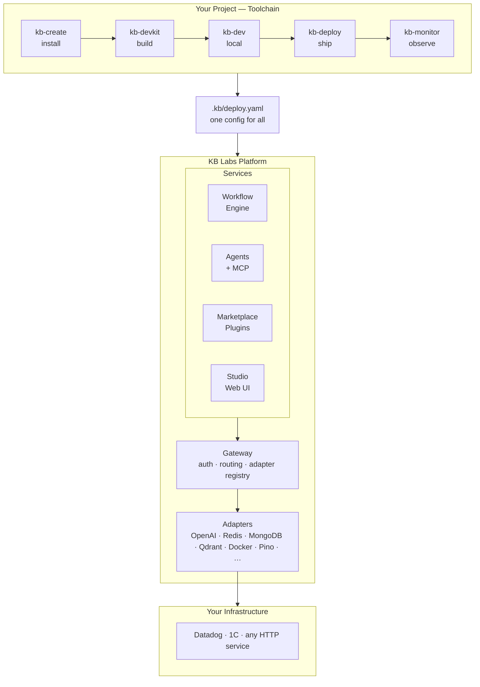

<p align="center">
  <strong>KB Labs</strong>
</p>

<p align="center">
  <a href="https://kblabs.ru" target="_blank">Website</a> ·
  <a href="https://kblabs.ru/docs" target="_blank">Docs</a> ·
  <a href="https://twitter.com/kblabsdev" target="_blank">Twitter</a> ·
  <a href="https://discord.gg/kblabs" target="_blank">Discord</a> ·
  <a href="https://t.me/kirill_baranov_official" target="_blank">Telegram</a>
</p>

<p align="center">
  <a href="https://github.com/KirillBaranov/kb-labs/blob/main/LICENSE-MIT">
    
  </a>
  <a href="https://github.com/KirillBaranov/kb-labs/blob/main/LICENSE-KB-PUBLIC">
    
  </a>
  = 20">
  = 1.22">
</p>

---

**Full-cycle development platform. Self-hosted. Open source.**

KB Labs covers the entire development workflow in one ecosystem — from scaffolding to production observability. Every tool shares the same config, the same permissions, and the same agent context. No glue code, no switching between five CLIs.

**TL;DR** — install alongside your stack, get the full dev cycle (build → run → deploy → observe → automate) in one config. Your existing tools stay. Migrate when you're ready — or never.

> **For CTOs:** Self-hosted, MIT core, your data stays on your VPS. Fork it, modify it, or walk away — the code goes with you. Zero vendor lock-in by design.

---

## Overview



---

## Get started

```bash
curl -fsSL https://kblabs.ru/install.sh | sh
```

This installs `kb-create` — the platform launcher. It runs a setup wizard, installs the platform on your machine or VPS, and optionally activates a **demo** (commit-plugin + 50 free gateway requests) so you can see the full cycle immediately:

```bash
kb-create --demo     # install + see it working on your own codebase
kb-create --yes      # install with defaults, no wizard
```

---

## The toolchain

Four Go binaries. Work standalone or as part of the platform. No Node.js required.

| Tool | Install | What it does |
|------|---------|-------------|
| [kb-devkit](tools/kb-devkit) | `curl -fsSL https://kblabs.ru/kb-devkit/install.sh \| sh` | Monorepo builds — topological ordering, content-addressable cache, workspace health |
| [kb-dev](tools/kb-dev) | `curl -fsSL https://kblabs.ru/kb-dev/install.sh \| sh` | Local service manager — start, stop, health probes, dependency ordering |
| [kb-deploy](tools/kb-deploy) | `curl -fsSL https://kblabs.ru/kb-deploy/install.sh \| sh` | Deploy to any VPS — Docker + registry, affected detection, infra management |
| [kb-monitor](tools/kb-monitor) | `curl -fsSL https://kblabs.ru/kb-monitor/install.sh \| sh` | Remote observability — health, logs, exec over SSH, no sidecar needed |

---

## The platform

The Node.js/TS layer. Installed by `kb-create`, runs alongside your services.

| | |
|---|---|
| **Workflow engine** | Automate any multi-step process: CI, releases, code review, onboarding |
| **AI agents** | Autonomous agents with planning, tool use, and MCP support |
| **Gateway** | Single entry point — auth, routing, adapter registry. Everything talks through it |
| **Plugin system** | Extend via SDK. Manifest + SDK = plugin. That's it |
| **Marketplace** | Install plugins, adapters, workflows from registry |
| **Studio** | Web UI for workflows, services, and plugin state |

---

## Adapters

Connect what you already have. Core doesn't know what's outside — adapters speak the language of your infrastructure.

| Category | Available |
|----------|-----------|
| LLM | OpenAI, VibeProxy |
| Storage | MongoDB, Redis, Qdrant |
| Logging | Pino, SQLite, Ring Buffer |
| Environment | Docker |
| Workspace | LocalFS, Worktree, Agent |

[Write your own adapter](https://kblabs.ru/docs/adapters) — including Datadog, Kafka, 1C, or any HTTP service.

---

## How services connect

Your service doesn't need to be rewritten to join the platform:

```
Push model   →  support the contract (manifest)
                platform finds it, wires it, collects observability automatically

SDK model    →  import @kb-labs/sdk
                access workflows, agents, gateway directly

HTTP model   →  expose any HTTP endpoint
                platform polls it, no changes needed
```

Three models. Zero rewrites. Existing infrastructure stays.

---

## Architecture

```
core/        Foundation: types, runtime, config, plugin system   MIT
sdk/         Public API for plugin authors                        MIT
shared/      Utilities: http, testing, cli-ui                     MIT
tools/       Go binaries: kb-devkit, kb-dev, kb-deploy, kb-monitor  MIT
─────────────────────────────────────────────────────────────────────
plugins/     All optional features: agents, workflow, gateway…   KB-Public
adapters/    Pluggable backends                                   KB-Public
cli/         The kb command                                       KB-Public
studio/      Web UI                                               KB-Public
```

Core defines contracts. Adapters implement them. Plugins use them.  
Core never knows what's above or outside it.

---

## Requirements

- **Node.js** >= 20, **pnpm** >= 9
- **Go** >= 1.22 (toolchain only — pre-built binaries available)
- **Docker** (optional — local infra and environment isolation)
- macOS or Linux

---

## License

| What | License |
|------|---------|
| `core/`, `sdk/`, `shared/`, `tools/` | [MIT](LICENSE-MIT) — use freely, including commercially |
| `plugins/`, `cli/`, `adapters/`, `studio/` | [KB-Public v1](LICENSE-KB-PUBLIC) — free for personal and internal use |

Building on KB Labs? MIT covers everything you need.  
Selling hosted access? [Get in touch](https://kblabs.ru/enterprise).

---

<p align="center">
  KB Labs is built with KB Labs — dogfooding all the way down.<br>
  Every workflow, every deploy, every agent run you see in this repo goes through the platform itself.
</p>

---

<p align="center">
  Built by <a href="https://k-baranov.ru">Kirill Baranov</a> · <a href="https://github.com/KirillBaranov">GitHub</a>
</p>
