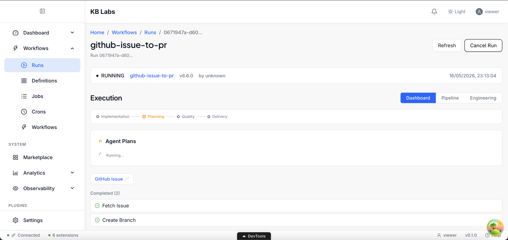
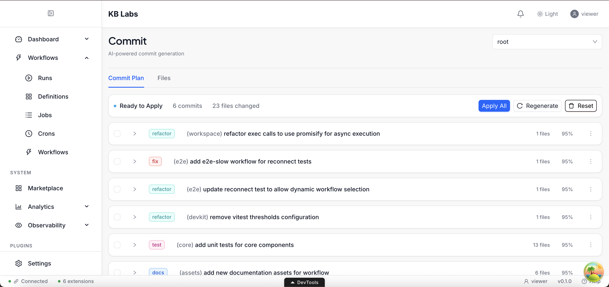
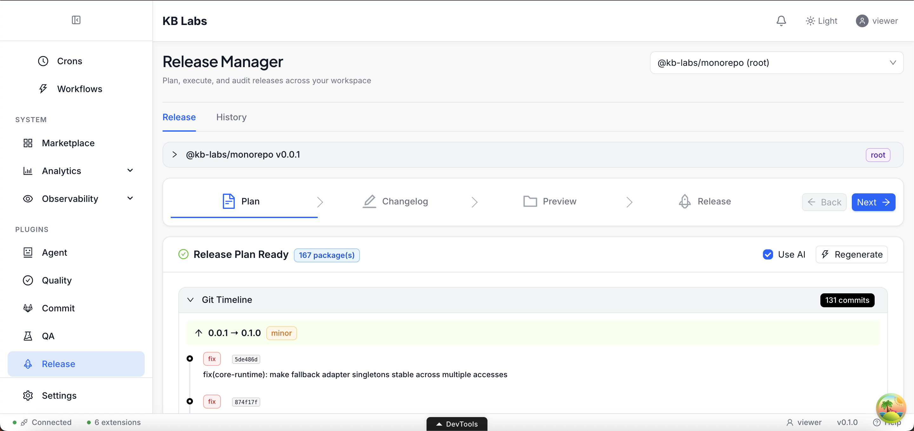

<h1 align="center">KB Labs</h1>

<p align="center">
  <strong>Open-source platform for developer automation.</strong>
  <br />
  Code review, commits, releases, and agent workflows — self-hosted and under your control.
</p>

<p align="center">
  <a href="https://kblabs.ru">Website</a> ·
  <a href="https://docs.kblabs.ru">Documentation</a> ·
  <a href="https://kblabs.ru/en/install">Install</a> ·
  <a href="https://kblabs.ru/en/changelog">Changelog</a> ·
  <a href="https://kblabs.ru/en/roadmap">Roadmap</a> ·
  <a href="https://discord.gg/kblabs">Discord</a>
</p>

<p align="center">
  <a href="https://www.npmjs.com/package/@kb-labs/cli-bin?activeTab=versions"></a>
  <a href="https://www.npmjs.com/package/@kb-labs/cli-bin?activeTab=versions"></a>
  <a href="https://github.com/kb-labs-team/kb-labs/actions/workflows/ci.yml?query=branch%3Amaster"></a>
  <a href="https://github.com/kb-labs-team/kb-labs/actions/workflows/e2e-platform.yml?query=branch%3Amaster"></a>
  <a href="https://github.com/kb-labs-team/kb-labs/actions/workflows/security.yml?query=branch%3Amaster"></a>
</p>

<p align="center">Open source · Self-hosted · No cloud required</p>



KB Labs turns engineering operations into versioned, observable workflows. Run the
same process from a terminal, CI, Studio, a schedule, or an agent — with the same
permissions, approvals, logs, and artifacts.

## Why KB Labs

Most automation tools connect generic steps. Your team still has to define what a
correct release looks like, how commits should be structured, which checks matter,
and where a human must make the final call.

KB Labs puts those decisions into plugins. A release plugin knows how to plan
versions, build, check, generate changelogs, and publish. A commit plugin knows how
your changes should be grouped and named. Workflows connect these capabilities into
the way your team operates:

```text
prepare → inspect artifacts → approve → commit and tag → publish → notify product
```

Implement the rule once, improve it in one place, and every workflow gets the same
behavior.

### We run KB Labs on KB Labs

- [`task-to-pr`](.kb/workflows/task-to-pr.yaml): issue or ClickUp task → plan
  approval → implementation → review and QA loops → CI → final approval → merge.
- [`release-prepare`](.kb/workflows/release-prepare.yml): preview → checks and
  build → approval → changelog and versions → commit and tag → CI publish.

These are the workflows used to build and release this repository. People make the
decisions; the workflow executes and records the repeatable work.

## Quick start

```bash
curl -fsSL https://kblabs.ru/install.sh | sh
kb-create --help
```

`kb-create` is a deterministic launcher: a release supplies a sealed index,
then a wizard, CI request or agent resolves and applies one compatible plan.
It has no `--demo` or positional-project install path. See the guide for the
human and non-interactive flows.

→ [Installation guide](https://kblabs.ru/en/install)

## How the pieces fit

| | Responsibility |
|---|---|
| **Plugins** | Package complete engineering capabilities: release, commit, review, QA, integrations, and agent tools. |
| **Workflows** | Compose capabilities with conditions, retries, approval gates, schedules, and artifacts. |
| **Adapters** | Keep LLMs, storage, cache, databases, and logging behind typed contracts so providers can change without rewriting plugins. |
| **Studio** | Shows runs, decisions, logs, artifacts, analytics, and configuration in one place. |

Plugins declare their environment, network, shell, and resource access. Agents get
only the commands exposed by a plugin — not raw credentials or unrestricted vendor
APIs.

→ [Workflows](https://docs.kblabs.ru/en/workflows) ·
[Plugins](https://docs.kblabs.ru/en/plugins) ·
[Adapters](https://docs.kblabs.ru/en/adapters) ·
[Architecture](https://docs.kblabs.ru/en/concepts/overview)

## See it in action

<p>
  
  
</p>

→ [Product demo](https://kblabs.ru/en/demo) ·
[Documentation](https://docs.kblabs.ru)

## Project status

Operational signals stay separate from the product header:

| Signal | Status |
|---|---|
| Production and documentation | [](https://github.com/kb-labs-team/kb-labs/actions/workflows/deploy.yml?query=branch%3Amaster) |
| Node.js | 24 or newer; CI runs on Node 24 |

→ [CI/CD reference](docs/ci-cd.md)

## Security

Found a vulnerability? Please **do not open a public issue**. Follow the
[Security Policy](SECURITY.md) for scope, reporting instructions, and disclosure.

## Contributing

```bash
pnpm install
pnpm build
pnpm check
kb-dev start
```

Start with [open issues](https://github.com/kb-labs-team/kb-labs/issues). Repository
conventions are in [`AGENTS.md`](AGENTS.md); architecture decisions are in
[`docs/adr`](docs/adr).

## License

| Code | License |
|---|---|
| `core/`, `sdk/`, `tools/` | [MIT](LICENSE-MIT) — free for commercial use |
| `plugins/`, `cli/`, `adapters/`, `studio/` | [KB-Public v1](LICENSE-KB-PUBLIC) — free for personal and internal use |

For hosted resale or commercial licensing, [get in touch](https://kblabs.ru/enterprise).

<p align="center">Built by <a href="https://k-baranov.ru">Kirill Baranov</a></p>
