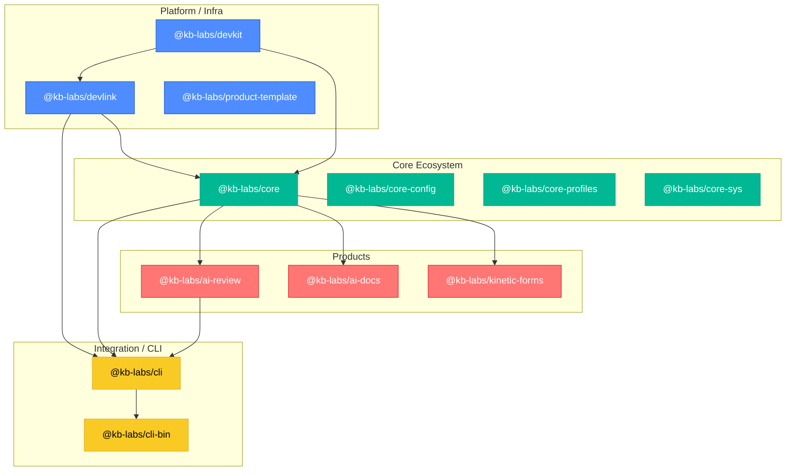

# ADR-0016: Layered Ecosystem Model

**Date:** 2025-10-07
**Status:** Accepted
**Deciders:** KB Labs Team
**Last Reviewed:** 2025-11-03
**Tags:** [architecture, process]  

## Context

As KB Labs grows, the number of repositories and packages increases rapidly. To prevent architectural drift, dependency chaos, and redundant code, the ecosystem must follow a layered model with clear separation of responsibilities and dependency flow.

This ADR defines the three-layer architecture for the KB Labs ecosystem and the guiding principles for how packages and repositories should interact.

## Decision

We establish a three-layer architecture model for the KB Labs ecosystem with strict dependency flow rules.

### Layer Structure

| Layer | Purpose | Examples |
|-------|---------|----------|
| **Platform / Infra** | Foundational developer tooling, automation, and SDKs that can be used inside and outside KB Labs | `@kb-labs/devkit`, `@kb-labs/devlink`, `@kb-labs/product-template` |
| **Core Ecosystem** | Internal shared modules and services that implement KB Labs-specific rules, schemas, or runtime behavior | `@kb-labs/core`, `@kb-labs/core-config`, `@kb-labs/core-profiles` |
| **Products / Applications** | Public or internal tools, assistants, and products built on top of the core layer | `@kb-labs/ai-review`, `@kb-labs/ai-docs`, `@kb-labs/kinetic-forms` |
| **Integration / CLI** | Entry points and orchestration layers for unified access | `@kb-labs/cli`, `@kb-labs/cli-bin` |

### Dependency Flow

All dependencies must follow a **top-down direction**:

```
devkit  →  devlink  →  core  →  products
  ↘          ↘
   cli-bin / cli
```

**Rules:**
- Lower layers must never import from higher layers
- Shared logic should be moved downward (to core or platform) if reused
- CLI may depend on any layer, but not vice versa

### Layer Responsibilities

#### Platform (Infra)
- Implements cross-cutting infrastructure and tooling
- Must be agnostic to KB Labs products
- Can be published and used by external developers
- Example: DevKit, DevLink, Product Template

#### Core
- Defines the internal architecture rules for KB Labs
- Implements shared services (profiles, config, fs, sys)
- Serves as the "nervous system" of the ecosystem
- Can depend on Platform, but not vice versa

#### Product
- Represents end-user-facing tools and assistants
- May use both Core and Platform
- Should not leak implementation details back into Core

#### Integration / CLI
- Entry point for developers and automation tools
- Provides unified commands, consistent UX, and policy enforcement

### Architecture Diagram


## Rationale

**Benefits:**
- Predictable dependency flow
- Easier cross-repo upgrades and version sync
- Clear separation of public vs. internal APIs
- Simpler onboarding and documentation
- Reduced risk of circular dependencies

## Implementation

### Enforcement Guidelines

Each repository must declare its layer in `kb-labs.config.json`:

```json
{
  "layer": "core"
}
```

The DevKit Check and DevLink Policy will validate that:
- Dependencies respect the layer hierarchy
- Core packages are not importing product code
- Platform packages remain product-agnostic

## Consequences

**Positive:**
- Enables long-term scalability and clean architecture
- Simplifies mental model of the ecosystem
- Encourages modularity and reuse of platform tools

**Negative:**
- Adds slight upfront complexity for new contributors
- May require refactoring of legacy shared code

## Follow-ups

- `devkit check layers` — enforce the layer hierarchy automatically
- `devlink graph` — visualize cross-layer dependencies
- KB Labs Studio integration for ecosystem mapping

---

*Last updated: October 7, 2025*  
*Next review: January 7, 2026*