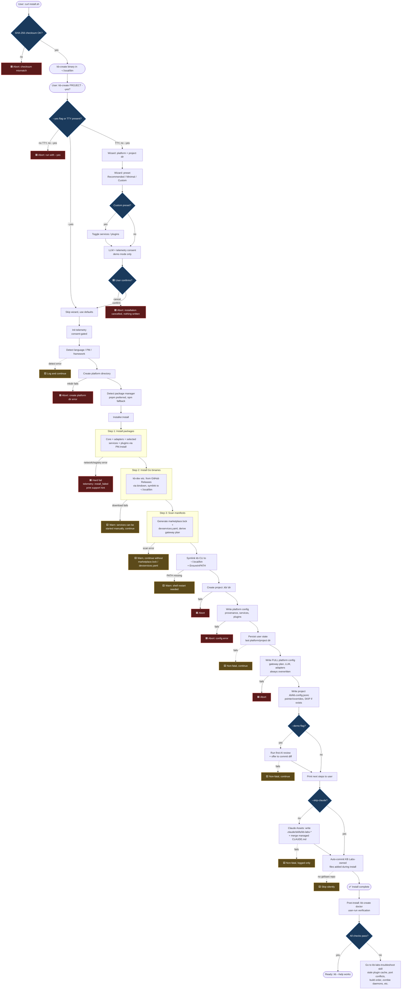
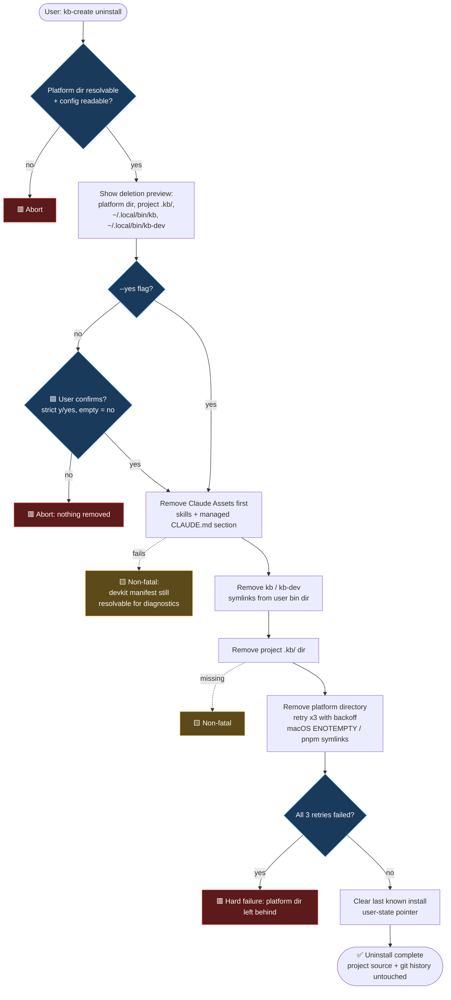

# KB Labs — Installation / Update / Uninstall Flow

> Process diagrams (BPMN-style, rendered as Mermaid) for the `kb-create` installer lifecycle.
> Source of truth: `tools/kb-create/` (Go implementation) + `.claude/skills/kb-labs-update/SKILL.md` +
> `.claude/skills/kb-labs-troubleshoot/SKILL.md` + `docs/qa/scenarios/PC-001-clean-install.md` / `S-001-solo-install-first-run.md`.

**Note on scope:** the original ask assumed uninstall was roadmap-only. It isn't — `kb-create uninstall`
(`tools/kb-create/cmd/uninstall.go`) is fully implemented today, so it's documented below alongside
install/update rather than flagged as future work.

Swimlanes used across all three diagrams:

- **User** — runs commands, answers wizard prompts, confirms diffs/destructive actions
- **kb-create CLI** — the Go binary orchestrating everything; owns all decision points
- **Package Manager** (pnpm/npm) — installs/updates npm packages
- **GitHub Releases** — binary downloads (kb-dev etc.) + kb-create self-update
- **Filesystem / Config** — platform dir, project `.kb/`, `~/.local/bin` symlinks
- **Claude Assets** — `.claude/skills/kb-labs-*` + managed CLAUDE.md section (always a non-fatal side lane)

Legend: 🟥 hard failure (aborts, non-zero exit) · 🟨 soft failure (warns, continues) · 🟦 user decision point

---

## 1. Install

Entry point: `curl -fsSL https://kblabs.ru/install.sh | sh` (downloads `kb-create` binary to
`~/.local/bin`, verifies SHA-256 against `checksums.txt`) → then `kb-create <project>`.

**Known real-world failure (from `S-001` QA run, v2.94.0):** `--llm` bootstrap can hit a 401 on gateway
registration → `.env` is never written → LLM features silently fall back to heuristics (e.g.
`kb commit` still works, just without AI). This is the `L1x`-adjacent soft path in practice — the
install itself doesn't abort, but a downstream feature degrades. Worth fixing but not a blocker.

---

## 2. Update

Entry point: `kb-create update` (guided by `.claude/skills/kb-labs-update/SKILL.md`).

```mermaid
flowchart TD
    A(["User: kb-create update"]) --> B{"Platform dir resolvable?<br/>flag / root flag /<br/>.kb/install.json / user state"}
    B -- no --> B1["🟥 Abort: platform directory not specified"]
    B -- yes --> C["Load current manifest,<br/>resolve registry<br/>explicit flag wins over saved"]
    C --> D["Init telemetry<br/>Nop fallback if config missing"]

    D --> E["Self-update kb-create binary<br/>check GitHub latest *-binaries tag"]
    E --> F{"Newer version available?"}
    F -- "check/download fails" --> F1["🟨 Warn only,<br/>continue with current binary"]
    F -- yes --> G["Download + Apply +<br/>syscall.Exec re-exec self"]
    G --> H["Rest of update runs<br/>under new binary"]
    F -- no --> H
    F1 --> H

    H --> I["Installer.Diff:<br/>installed vs desired package set"]
    I --> J{"Any changes?"}
    J -- no --> J1(["✅ Already up to date, exit"])
    J -- yes --> K{"Registry changed<br/>since last install?"}

    K -- yes --> K1{"🟦 User confirms<br/>registry switch? y/yes"}
    K1 -- "no/empty" --> K1x["🟥 Abort"]
    K1 -- yes --> L
    K -- no --> L["Print diff: Added / Updated / Removed"]

    L --> M{"🟦 User: Apply updates? Y/n"}
    M -- cancel --> M1["🟥 Abort: nothing applied"]
    M -- "confirm/default" --> N["Installer.Update"]

    subgraph N1["Package steps"]
        direction TB
        N1a["Install newly Added packages"]
        N1b["PM.Update over full installed set"]
        N1c["Refresh config snapshot<br/>manifest version, updated-by, registry"]
        N1d["Re-scan manifests, rewrite<br/>marketplace.lock / devservices.yaml /<br/>gateway upstreams"]
        N1a --> N1b --> N1c --> N1d
    end
    N --> N1
    N1 -- "fails at any step" --> N1x["🟥 Hard fail<br/>telemetry: update_failed<br/>do NOT hand-fix, run<br/>kb-create doctor --json,<br/>switch to troubleshoot skill"]

    N1 --> O{"--force flag?"}
    O -- yes --> O1["⚠️ Reset ALL platform config<br/>to manifest defaults<br/>discards LLM/custom adapters<br/>recommend confirming with user first"]
    O -- no --> O2["Preserve existing services /<br/>plugins / LLM settings"]
    O1 --> P
    O2 --> P["Refresh Claude Assets<br/>.claude/skills + CLAUDE.md"]
    P -. fails .-> P1["🟨 Non-fatal"]

    P --> Q(["✅ Update complete"])
    Q --> R["User verification:<br/>kb-create doctor + status<br/>+ pnpm kb --help"]
    R --> S["pnpm kb-dev restart<br/>if services configured"]
    S --> T["pnpm kb marketplace plugins refresh<br/>clear stale plugin manifests"]
    T --> U(["Ready"])

    classDef hardfail fill:#5c1a1a,stroke:#ff6b6b,color:#fff
    classDef softfail fill:#5c4a1a,stroke:#ffcc66,color:#fff
    classDef decision fill:#1a3a5c,stroke:#6bb3ff,color:#fff
    class B1,K1x,M1,N1x hardfail
    class F1,P1 softfail
    class B,F,J,K,K1,M,O decision
```

---

## 3. Uninstall

Entry point: `kb-create uninstall`. **Fully implemented** (`tools/kb-create/cmd/uninstall.go`) — not
roadmap. No dedicated skill file yet; `kb-labs-update` SKILL.md references it as the recommended path
for downgrading ("uninstall, then `kb-create` at desired version").

---

## Cross-cutting notes

- **Config ownership split** (ADR-0013): platform dir's `.kb/kb.config.jsonc` is installer-owned and
  always overwritten on install/update; project dir's `.kb/kb.config.jsonc` is user-owned, written
  once, never overwritten. This is why install/update never clobber user overrides but always refresh
  platform defaults.
- **`devservices.yaml` and `marketplace.lock` are always generated**, never hand-edited (matches root
  `CLAUDE.md`'s "DO NOT MODIFY" rule) — both install and update regenerate them from a manifest scan.
- **Doctor (`kb-create doctor [--fix]`)** is the standard first response to any post-install/update
  problem: checks PATH, `node`/`git`/`docker` versions, GitHub reachability (soft), `kb`/`kb-dev` in
  PATH, platform health (`node_modules` present, package count vs. manifest). `--fix` attempts
  auto-repair (PATH, symlinks, `node_modules` reinstall) then re-checks.
- **Troubleshoot skill forbids**: deleting `.kb/kb.config.json`, deleting `.kb/mind/` or `.kb/cache/`
  without asking, hand-editing files inside `.kb/`, running services with raw `node`/`pnpm *:dev`
  instead of `kb-dev`, running `pnpm -r build` instead of `kb-devkit` build-order tooling.
