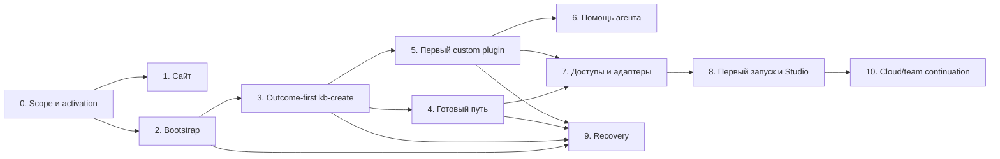
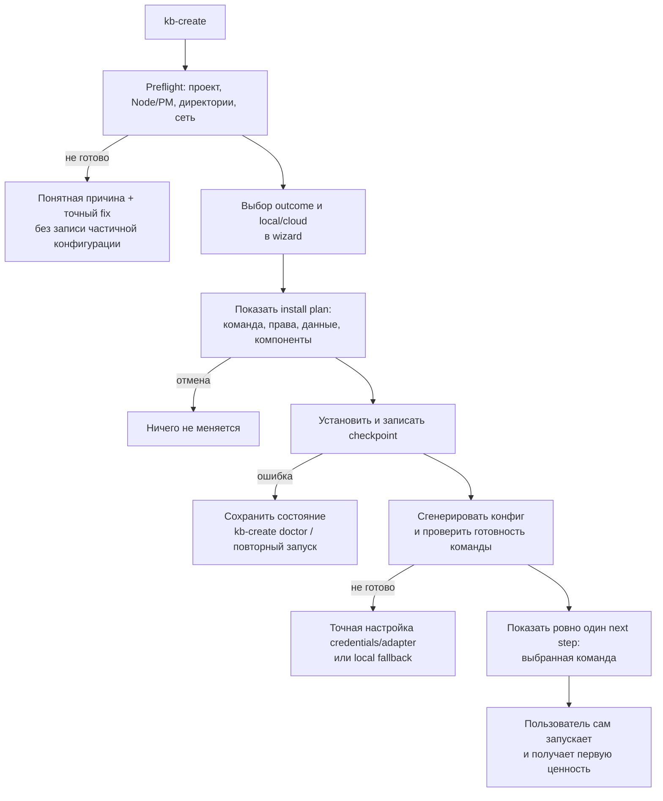
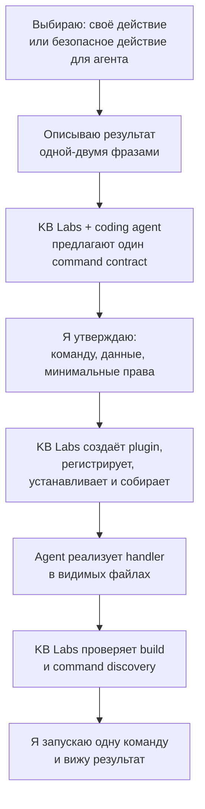
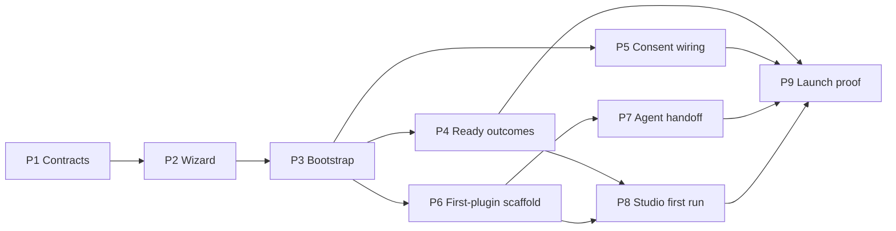

# Первый плагин: карта onboarding и декомпозиция

> **Статус:** активная продуктовая дискуссия  
> **Создано:** 2026-07-24  
> **Цель:** привести пользователя от узнавания ручной инженерной боли до первого собственного работающего плагина — без требования изучать документацию или проектировать workflow.

## Контекст

KB Labs автоматизирует инженерные процессы через плагины, адаптеры и, на более зрелом этапе, workflow. Первичная аудитория уже использует coding agents, но остаётся активным пользователем платформы: она хочет самостоятельно видеть варианты, выбирать конфигурацию и проверять результат.

Агент в первом опыте — проводник и соавтор, а не единственный интерфейс или потребитель KB Labs.

Связанные документы:

- [Demo Flow: First 5 Minutes](./2026-03-24-demo-flow-first-5-minutes.md) — ранняя стратегия demo-first.
- [Team Deployment — рабочая дискуссия](./2026-05-19-team-deployment-discussion.md) — локальный solo и cloud/team контуры.

## Проблема пользователя

Часть инженерного процесса держится на ручном контроле: подготовка коммитов и релизов, QA, безопасная работа агента с внутренними системами или иной внутренний процесс. Точечные аналоги не дают нужного сочетания расширяемости, безопасности, наблюдаемости и локального контроля.

## Основная user story

> Когда у меня есть небольшой, но регулярно ручной инженерный процесс, я хочу быстро найти или создать безопасную команду под нашу специфику, при необходимости с помощью моего coding agent, чтобы решить эту задачу сейчас и лично убедиться, что результат воспроизводим и находится под моим контролем.

## Критерий первой ценности

Пользователь в одной сессии создаёт или адаптирует плагин, запускает **одну полезную команду** на своём проекте и получает понятный результат. Он видит, что именно исполнилось, с какими правами и где искать диагностику.

Эмоциональный результат: «Это решило мою задачу легко и без магии».

## Сквозной UX-инвариант: понятность при сложной платформе

Платформа может быть сложной внутри, но onboarding не переносит эту сложность на пользователя. На любом экране или в любом сообщении пользователь должен без документации ответить на четыре вопроса:

1. **Что я пытаюсь получить сейчас?** Одна человеческая цель, не название внутреннего компонента.
2. **Что KB Labs сделает автоматически?** Короткий перечень без технического шума.
3. **Что требуется от меня или моего агента?** Только следующее необходимое действие; секрет, доступ или подтверждение — с объяснением причины.
4. **Что произойдёт дальше?** Один предсказуемый результат или следующая команда.

### Правила применения

- Сначала outcome, затем технические детали по требованию. Не просить выбрать plugin, adapter, service или workflow, если это можно вывести автоматически.
- Один экран — одно решение. Не совмещать выбор LLM, analytics, Studio, сервисов и прав в одну форму.
- Любой внешний data boundary показывать в момент принятия решения: free LLM gateway, BYOK, внешняя интеграция, analytics. Указать что именно уходит, зачем, куда, что хранится и какая есть local/skip альтернатива.
- Всё, что безопасно определить или создать автоматически, launcher делает сам и явно отмечает как выполненное.
- Если требуется человек или agent, сформулировать готовое действие: команда для копирования, путь к файлу, prompt/контекст для агента или кнопка/выбор. Не отправлять пользователя «читать документацию».
- После каждого завершённого этапа показывать один главный next step. Диагностика, Studio и docs остаются доступными, но вторичными.
- Не скрывать риск за удобством: destructive action, commit, push, publish, удалённый вызов и передача кода требуют отдельного ясного согласия.

### Формат значимого шага

```text
Цель:       [человеческий результат]
KB Labs:    [что сделает автоматически]
Нужно от вас: [только необходимое действие / «ничего»]
Данные:     [только если пересекается внешняя граница]
Дальше:     [один следующий результат]
```

Этот формат применяется к wizard, post-install handoff, `doctor`, agent prompt и Studio empty/error states.

### Голос платформы

Понятность не означает сухой корпоративный тон. KB Labs звучит как современный уверенный инженерный продукт: коротко, живо и по делу — платформа берёт сложность на себя, но не скрывает важных последствий.

- Говорить результатом: «Проверим текущий diff», а не «Выберите конфигурацию review plugin».
- Уверенно сообщать автоматические действия: «Мы нашли pnpm и git — настроим всё сами».
- Для выбора с последствиями использовать человеческий контекст, а не юридический шум: «AI review отправит diff в KB Labs Gateway. Ничего не сохраняем. Можно подключить свой ключ или остаться локально.»
- Ошибки формулировать без обвинения и без тупика: «Не видим Node 20+. Обновите Node и запустите эту же команду ещё раз.»
- Показывать детали и логи по запросу, а не прятать их; основной поток остаётся лёгким.

Пример вместо механического шаблона:

```text
Проверим ваши изменения

Мы уже нашли git и TypeScript. Установим review и подготовим локальный запуск.
Ничего от вас не нужно.

Дальше — одна команда, и увидите первый отчёт по текущему diff.
```

## Границы первого опыта

Включено:

- одна конкретная боль;
- один плагин;
- одна полезная команда;
- минимально необходимые адаптеры и permissions;
- запуск через CLI и доступность команды внешнему coding agent;
- локальный режим без авторизации или облачный режим с авторизацией;
- наблюдение результата и диагностика в Studio.

Исключено из первичного onboarding:

- композиция нескольких команд в workflow;
- approvals, расписания и многошаговая оркестрация;
- полный командный rollout и fleet management.

Это не отказ от workflow: он становится естественным вторым уровнем, когда у пользователя уже появились несколько проверенных команд.

## Карта пути

```mermaid
flowchart LR
  A["Ручной инженерный процесс\nи потеря контроля"] --> B["Сайт:\nузнаёт свою боль в кейсе"]
  B --> C["Установка:\ninstall.sh → kb-create"]
  C --> D{"Режим"}
  D -->|"Локальный"| E["Без авторизации\nличный/self-hosted контур"]
  D -->|"Облачный"| F["Авторизация, организация\nадмин и инвайты"]
  E --> G["kb-create:\nвыбрать или описать небольшую боль"]
  F --> G
  G --> H{"Есть готовое решение?"}
  H -->|"Да"| I["Установить или настроить\nготовый плагин"]
  H -->|"Нет / нужна адаптация"| J["Scaffold своего плагина\nс помощью агента"]
  I --> K["Одна полезная команда"]
  J --> K
  K --> L["Запуск из CLI\nили внешнего агента"]
  L --> M["Studio:\nрезультат, логи, права"]
  M --> N["Первая ценность:\nзадача решена под контролем"]
  N -. "позже" .-> O["Несколько команд → workflow\napprovals, расписания, команда"]
```



## Роли поверхностей

| Поверхность | Роль в пути | Пользователь делает сам | Агент помогает |
|---|---|---|---|
| Сайт | Примерка кейса | Узнаёт свою проблему в понятном примере | Может помочь соотнести кейс с текущим проектом |
| `kb-create` | Конфигуратор решения | Выбирает режим, готовое решение или custom-путь | Уточняет задачу, объясняет выбор и генерирует основу |
| CLI | Быстрый контроль и запуск | Вызывает команду, читает результат | Вызывает только разрешённые команды и исправляет реализацию |
| Studio | Наблюдаемость и доверие | Проверяет ход, логи, права и результат | Не заменяет визуальную проверку пользователя |

## Продуктовые решения, принятые в дискуссии

1. Сайт помогает примерить кейс на себя; он не должен требовать понимания архитектуры.
2. `kb-create` — не только installer, а место поиска готового решения и сборки небольшого custom-решения.
3. Первичный артефакт — плагин с одной полезной командой, не workflow.
4. Пользователь сохраняет обзор и контроль; coding agent сокращает путь к работающему решению.
5. Local и cloud — варианты одного пути. Local работает без авторизации; в cloud есть авторизация, администратор и приглашение коллег.

## Декомпозиция первой реализации: `kb-create`

| Шаг | Нужная функциональность | Успех | Если что-то идёт не так |
|---|---|---|---|
| 1. Определить контур | Выбор `local` / `cloud` с коротким объяснением последствий | Пользователь понимает, где будут работать данные и Studio | Вернуться к выбору до записи конфигурации; показать безопасный local-default |
| 2. Выбрать боль | Небольшой каталог кейсов + вариант «своё» | Пользователь выбирает один понятный outcome, а не набор компонентов | Предложить описать задачу свободным текстом и начать custom-path |
| 3. Найти готовое | Сопоставление кейса с готовым плагином/пресетом и явный список того, что будет установлено | Пользователь понимает, какую команду получит | Если готового совпадения нет — не заводить в тупик, перейти к custom-path |
| 4. Собрать своё | Scaffold, который создаёт минимальный плагин: manifest, одну команду, handler, permissions и тестовый каркас | Создан понятный, редактируемый проект плагина | Дать агенту короткий контекст и следующий безопасный шаг; сохранить черновик и позволить продолжить позже |
| 5. Настроить доступы | Выбор только нужных адаптеров и permissions с объяснением | Плагин запускаем и не получает лишних прав | Заблокировать запуск только при обязательном доступе; дать точную инструкцию по конфигурации и local fallback, если он возможен |
| 6. Проверить результат | Один явный запуск команды и ссылка/команда открытия Studio | Пользователь видит полезный эффект на своём проекте | Показать actionable diagnosis: что не запустилось, где логи, как повторить или откатить |
| 7. Закрепить | Итог: команда, местоположение плагина, права, следующий шаг | Пользователь способен повторить действие без wizard | Предложить доработку плагина с агентом, но не навязывать workflow |

## Текущая опора в коде

`kb-create` уже содержит intent-driven TUI в `tools/kb-create/internal/wizard/` и manifest с готовыми intent'ами:

- `release` — установить release-плагин;
- `ai-review` — установить AI review и выбрать LLM;
- `plugin-author` — поставить scaffold и подготовить локальный dev loop;
- `custom` — вручную выбрать services, plugins и adapters;
- `explore` — поставить полный набор для исследования.

Это хорошая основа, но текущая модель делит пользователя по архитектурному намерению («поставить release», «написать плагин», «выбрать компоненты»). Целевая модель должна сначала спросить о небольшой боли/результате, а уже затем скрыто подобрать или создать нужные компоненты.

Текущий выбор `studioAccess` различает защищённый и local Studio. Полноценный cloud/team flow (identity, admin, invitations) остаётся отдельной последующей работой и не должен блокировать local-first первый опыт.

## Направление первого инкремента

Не вводить workflow в wizard. Расширить существующий intent flow так, чтобы он:

1. показывал несколько пользовательских outcomes, включая «автоматизировать своё действие»;
2. для готового outcome показывал ровно одну команду, которую пользователь получит;
3. для custom outcome входил в `plugin-author`/scaffold с минимальным шаблоном одной команды, а не в общий ручной picker компонентов;
4. после установки выдавал один runnable next step и команду открытия Studio;
5. оставлял полный `custom` picker как advanced path, а не как дефолт при отсутствии готового совпадения.

## Рабочая декомпозиция: путь до первой ценности

Это порядок проработки и реализации. Каждый шаг должен быть самодостаточно проверяемым; следующий не маскирует незавершённость предыдущего.

| № | Задача | Что закрывает для пользователя | Зависит от | Definition of done |
|---:|---|---|---|---|
| 0 | Зафиксировать launch scope и сигнал успеха | Единое понимание, какой первый outcome обещаем и что считаем activation | — | Выбраны два готовых outcome и custom-путь, критерий activation и поддерживаемые контуры; явно исключены workflow из MVP |
| 1 | Сайт: кейс → запуск | Пользователь узнаёт свою боль и понимает, что попробовать дальше | 0 | У каждого launch-кейса есть понятный результат, CTA в `kb-create` и нет архитектурного перегруза |
| 2 | Надёжный bootstrap | `install.sh` и `kb-create` приводят в рабочую стартовую точку без ручной подготовки | 0 | Повторный запуск безопасен; неподдерживаемая среда, сеть и права дают ясную диагностику и восстановление |
| 3 | Outcome-first вход в `kb-create` | Пользователь выбирает одну боль, а не services/plugins | 0, 2 | Wizard предлагает outcomes, custom outcome и advanced path; сохраняет выбранное намерение в итоговой конфигурации |
| 4 | Готовый путь | Готовый кейс даёт одну полезную установленную команду | 3 | Перед установкой показаны команда, зависимости и доступы; после — команда реально доступна и запускаема |
| 5 | Custom путь: первый плагин | При отсутствии готового решения пользователь создаёт минимальный плагин с одной командой | 3 | Scaffold создаёт manifest, handler, command, минимальные permissions и тест; пользователь понимает, что и где создано |
| 6 | Помощь coding agent | Агент ускоряет проектирование и реализацию, не отбирая контроль | 5 | Пользователь получает короткий переносимый контекст/промпт; агент может продолжить работу без чтения всей документации; все изменения видимы пользователю |
| 7 | Настройка доступов и адаптеров | Команда получает ровно необходимый доступ и честно объясняет последствия | 4 или 5 | Обязательные настройки валидируются до запуска; опциональные можно пропустить; показаны local fallback и конкретные шаги исправления |
| 8 | Первый запуск и наблюдаемость | Пользователь запускает команду на своём проекте и видит результат | 4/5, 7 | Один явный next step запускает команду; CLI даёт результат и ссылку/команду Studio; Studio показывает execution, логи и permissions |
| 9 | Recovery и продолжение | Ошибка не превращает onboarding в тупик | 2–8 | Для каждого шага есть retry/back/skip, сохранение прогресса и actionable diagnosis; команда повторно запускается без wizard |
| 10 | Cloud/team continuation | После личной ценности админ может перевести решение в командный контур | 8 | Отдельный план; не является blocker local-first activation |

### Зависимости



### Правило проработки

Для каждой задачи фиксируем до реализации:

1. пользовательский вход и обещаемый результат;
2. конкретное поведение интерфейса/CLI и создаваемые артефакты;
3. минимальные технические изменения и их владельцев в репозитории;
4. happy path, отмену, повторный запуск и ошибочные состояния;
5. проверку результата: автоматическую и ручную.

## Задача 0 — launch scope и activation

**Статус:** проработано, ожидает продуктового подтверждения.

### Решение по launch-outcomes

В launch wizard есть два готовых outcome и отдельный custom-путь. Они сформулированы через результат пользователя, а не через названия плагинов или компонентов.

| Outcome в `kb-create` | Первая команда / результат | Реальная опора сейчас | Launch-ограничение |
|---|---|---|---|
| Подготовить понятные коммиты | `kb commit generate` / dry-run плана коммитов | `@kb-labs/commit` уже есть в installer manifest | Первый запуск не создаёт и не пушит коммиты; apply — осознанный следующий шаг |
| Подготовить релиз | `kb release plan` с планом версий и проверок | `@kb-labs/release-manager-cli` уже подключён как intent | Не публиковать в first run; `NPM_TOKEN` остаётся необязательным до publish |
| Создать свою команду | Собственная одна команда, созданная через scaffold; включает узкое безопасное действие для агента | `@kb-labs/scaffold` уже есть в installer manifest | Не открывать ручной picker всех services/plugins до первого результата |

`Review`, `QA` и готовые integration presets не входят в MVP launcher. Они добавляются только когда получат столь же качественную install → first-command цепочку. ClickUp остаётся reference implementation для custom-path, но не auto-installed preset.

### Activation: что именно должно произойти

**Activation — не установка.** Пользователь активирован, когда выполнены все условия:

1. выбран один outcome;
2. на его проекте выполнена первая команда без инфраструктурной ошибки;
3. пользователь увидел предметный результат: отчёт, план или подтверждённый side effect;
4. известна точка контроля: CLI output и путь в Studio/logs;
5. для custom path пользователь знает расположение созданного плагина и видит, какую одну команду он добавил.

Для аналитических команд результат с findings или «план пуст» — валидная первая ценность, а не ошибка onboarding. Ошибкой считаются отсутствие доступной команды, неготовая среда, неясные credentials/permissions или невозможность понять, что делать дальше.

### Scope local-first MVP

В MVP поддерживается local-first путь до activation:

- установка и запуск на проекте пользователя;
- local Studio без обязательной авторизации;
- явное, opt-in подключение LLM или внешней интеграции;
- пользователь лично запускает и проверяет действие; внешний coding agent может использовать только созданную/установленную команду.

Не блокируют MVP:

- облачная организация, администратор и invitations;
- shared Studio и fleet distribution;
- workflow, approvals и schedules;
- автоматический запуск мутаций, публикаций или push в первой сессии.

### Последствия для реализации

| Изменение | Зачем |
|---|---|
| Заменить технические labels intent'ов на outcome copy | Пользователь выбирает решаемую боль, а не архитектурную конфигурацию |
| Для каждого готового outcome описать одну safe first command | `kb-create` может честно показать результат до установки и выдать один next step после неё |
| Custom integration и «своё действие» вести через minimal scaffold | Безопасность задаётся allowlist'ом одной команды и минимальными permissions, а не широким готовым API-плагином |
| Сохранить advanced custom picker отдельно | Он нужен power users, но не должен быть fallback, который ломает первый опыт |
| Дополнить installer manifest готовыми путями только после проверки e2e | Не добавлять QA/ClickUp в launch каталог, пока их install → first command цепочка не доказана |

### Проверка задачи 0

- Ручная: новый пользователь может сопоставить свою боль с release, commit или custom path без знания терминов «plugin», «adapter» и «workflow».
- Автоматическая: на чистом проекте для двух готовых outcomes проходит `install → command available → first command`; custom path проходит `install → scaffold → build → command available → command`.
- UX: destructive действия недоступны как auto-run и требуют отдельного осознанного шага.

## Задача 2 — launcher: bootstrap до готовности первого запуска

**Статус:** проработано; реализация следует после outcome-first wizard (задача 3), потому что launcher должен знать выбранную первую команду.

### Вывод из текущего состояния

`kb-create` уже умеет устанавливать пакеты и Go-бинарники, генерировать конфигурацию, определять проект и создавать Claude Code assets. У него также есть `doctor` для диагностики.

Но текущий post-install контракт не соответствует целевому пути:

- после любой установки вызывается `RunFirstDemo`, который при наличии изменений сам запускает review;
- installer автоматически коммитит KB Labs-owned файлы в репозиторий пользователя;
- generic «What's next» одновременно предлагает review, commit, services и `--help`, даже если пользователь пришёл с другой болью;
- local mode — отдельный opt-in, в то время как launch MVP должен вести к local-first безопасному по умолчанию пути.

### Целевой контракт launcher

Launcher обязан довести пользователя до **готовности выбранной первой команды**, но не выполнять бизнес-действие без явного выбора пользователя.



### Функциональные требования

| Этап | Поведение | Артефакт/состояние | Recovery |
|---|---|---|---|
| Preflight | До сетевых и файловых изменений проверить project path, Node/PM, свободный доступ к platform dir и наличие нужного бинарника | Только диагностический вывод | Короткая команда/ссылка для исправления; повторный `kb-create` без cleanup |
| Выбор контура | Для нового solo пользователя предложить `Local (recommended)`; cloud остаётся явным дальнейшим выбором | Выбранный mode в config/state | Back возвращает к выбору до установки |
| Install plan | До подтверждения показать: outcome, единственную first command, устанавливаемые плагины/services, нужные permissions и какие данные покинут машину | План в terminal; после подтверждения — persisted intent | Cancel не создаёт платформу, проектную конфигурацию или git commit |
| Installation | Ставить только компоненты выбранного пути, показывать прогресс и не скрывать существенные warnings | Platform config, project `.kb/`, install checkpoint | Ровно одна команда диагностики (`kb-create doctor`) и безопасный повторный запуск; partial install распознаётся, а не маскируется как свежий |
| Readiness | Проверить discovery первой команды и обязательные adapters/credentials; запуск сервисов предлагать только если выбранной команде они нужны | Readiness result рядом с intent в state | Отсутствующий optional LLM не блокирует heuristic review; обязательный secret объясняется до запуска |
| Handoff | Показать одну команду и один путь наблюдения (Studio/log file), затем предложение расширить решение | Итоговый summary с путями и повторной командой | Пользователь может закрыть terminal и продолжить по итоговой команде без wizard |

### Решения по автоматическим действиям

1. Убрать автоматический `RunFirstDemo` из общего post-install flow. Его логика может стать явным действием только внутри outcome «Проверить изменения» — после согласия пользователя.
2. Не выполнять автоматически `git commit` в пользовательском репозитории. Если нужно не загрязнять diff установочными файлами, показать их перечень и предложить отдельную явную команду/подтверждение.
3. `What's next` заменить на outcome-specific handoff: одна первая команда — первая строка; диагностика и Studio — вторичные ссылки; `kb --help` — опционально.
4. Не требовать cloud-auth или LLM, если выбранный first command может корректно работать локально.

### Failure matrix MVP

| Сбой | Что видит пользователь | Что сохраняем | Следующее действие |
|---|---|---|---|
| Нет TTY | Неподходящий интерактивный режим и примеры non-interactive вызова с outcome | Ничего | Запустить с явным `--intent` / в интерактивном terminal |
| Неподдерживаемый Node/PM | Требуемая версия и найденная версия | Ничего | Установить/выбрать поддерживаемый runtime и повторить |
| Нет сети/registry | Какой источник и шаг недоступны; путь к подробному логу | Checkpoint без ложного completion | Повторить установку после восстановления сети; `doctor` показывает незавершённые компоненты |
| Запись в проект/платформу невозможна | Конкретный каталог и системная ошибка | Ничего или только безопасный preflight log | Выбрать иной `--platform`/проект или исправить права |
| Частично установленные packages/binaries | Что успело установиться и что нет | Checkpoint + installer log | Повторить тот же install; не предлагать запуск до readiness |
| Нет LLM key | Команда продолжает в local/heuristic режиме, если это допустимо | Config без key | Явно предложить opt-in позже, но не считать установку сломанной |
| Нет обязательного secret для integration | Какая переменная нужна, почему и к какой команде относится | Config и intent, но не secret | Добавить secret и повторить readiness/first command |
| Команда не обнаружена после install | ID плагина, путь к log и `doctor` | Checkpoint `needs-repair` | `kb-create doctor`; повторить scan/refresh, затем повторить команду |

### Минимальные технические изменения

- `tools/kb-create/cmd/create.go`: разделить install, config, readiness и handoff; убрать глобальные auto-demo и auto-commit side effects.
- `tools/kb-create/internal/wizard/`: передавать выбранный outcome, contour и first-command plan.
- `tools/kb-create/internal/installer/` / scaffold: записывать машиночитаемый completion/checkpoint state, достаточный для `doctor` и идемпотентного повторного запуска.
- `tools/kb-create/cmd/output.go`: заменить generic next steps на outcome-specific handoff.
- E2E: добавить clean-machine сценарии для каждого ready outcome, cancellation без файлов и recovery после оборванной установки.

### Definition of done

На чистой машине пользователь выбирает local-first outcome, видит plan, завершает bootstrap и может закрыть terminal. Вернувшись, он выполняет одну показанную команду без повторного wizard. Launcher не запускает review, не создаёт commit и не инициирует внешние вызовы без отдельного согласия.

## Задача 3 — outcome-first диалог `kb-create`

**Статус:** проработано; готово к превращению в технический план после подтверждения отмеченного решения.

### Принцип диалога

Wizard не спрашивает новичка, какие ему нужны services, adapters или plugins. Он сначала спрашивает, какой **один результат** пользователь хочет получить. Технические компоненты подбирает manifest, а пользователь видит их только в понятном плане перед установкой.

Полный ручной picker остаётся за явным пунктом «Я знаю, что настраиваю» и не используется как fallback для custom path.

### Экраны happy path

| Экран | Содержимое и действие | Когда пропускаем |
|---|---|---|
| 0. Контекст проекта | Определённый project root и краткий профиль (`TypeScript · pnpm · git`); смена пути — вторичное действие | Если проект корректно передан аргументом/из cwd, не требовать подтверждения директории |
| 1. Outcome | Два готовых outcome и custom path из задачи 0; у каждого — одна строка обещанного результата и first command | Никогда |
| 2. Контур | `Локально на этом компьютере (recommended)`; `Подключиться к облачной команде` только для готового cloud flow | Local заранее выбран для local-first MVP; не задавать экран, если режим задан флагом |
| 3. Условия команды | Только то, что нужно выбранному outcome: opt-in LLM, обязательный secret интеграции или подтверждение безопасной области действия | Review heuristic и release plan идут сразу к plan; не показывать LLM/secret экран без необходимости |
| 4. Install plan | Outcome, первая команда, что будет установлено, права, данные за пределами машины, расположение файлов; `Install` / `Back` / `Cancel` | Никогда |
| 5. Progress и readiness | Прогресс установки, затем проверка доступности первой команды | Никогда после подтверждения |
| 6. Handoff | Одна команда для копирования, место плагина/конфига и один путь наблюдения | Никогда; это финальный экран, а не generic help |

### Copy первого экрана

```text
What would you like to automate first?

  ○  Prepare my commits
      Create a reviewable plan of conventional commits.

  ○  Prepare a release
      Calculate a release plan without publishing anything.

  ○  Create my own command
      Scaffold one command for a process unique to my team or agent.

  ↑↓ move · enter select · esc quit
```

В русской локализации copy должен быть продуктовым, а не техническим; язык определяется отдельной i18n-политикой и не блокирует launch flow.

### Outcome → минимальный маршрут

| Outcome | Технический bundle | Первая команда | Вопросы до install | Handoff после install |
|---|---|---|---|---|
| Prepare commits | `commit` + LLM capability | `kb commit generate` | Явный выбор LLM/data consent или safe skip в режим, который не обещает генерацию | Открыть план; `apply` — отдельный mutate шаг |
| Prepare release | `release` | `kb release plan` | Нет; token только перед publish | Открыть release plan; publish отсутствует из handoff |
| Create own command | `scaffold` + one-command template | После scaffold — созданная команда, в том числе безопасная integration command | Имя команды и короткое описание результата | Путь к manifest/handler + prompt для coding agent + run/test command |

### Cloud contour

Для целевого режима cloud экран формулируется как «Подключиться к облачной команде», а не «Запустить облако». Он требует invite/endpoint и аутентификацию; создать организацию, стать admin и приглашать коллег — отдельный team-onboarding flow.

До готовности этого flow local — единственный launch-ready choice. В интерфейсе нельзя показывать неработающий cloud option как равноправный путь; допустимы только disabled preview с честной формулировкой или документированный connect-existing режим.

### Данные manifest и selection

Текущий `Intent` хранит label, description, bundle, setup steps и `nextSteps`. Для outcome-first flow он должен иметь контракт, достаточный для plan и handoff:

```ts
type FirstCommand = {
  command: string;
  description: string;
  operation: 'analyze' | 'mutate';
  requires: {
    llm?: 'optional' | 'required';
    env?: string[];
    services?: string[];
  };
  dataBoundary?: string;
  observe?: { studio?: boolean; logHint?: string };
};

type OutcomeIntent = {
  id: string;
  label: string;
  description: string;
  bundle: IntentBundle;
  firstCommand: FirstCommand;
  customTemplate?: 'safe-integration' | 'one-command';
};
```

`Selection` дополнительно сохраняет stable outcome ID, mode (`local` / `cloud`) и readiness requirements. Это позволяет вывести один и тот же handoff при первом запуске, после `doctor` и при повторном вызове launcher.

### Back, cancel и invalid states

| Состояние | Поведение |
|---|---|
| Back с экрана условий | Возврат к outcome с сохранённым выбором; credentials не показывать и не записывать повторно |
| Cancel до confirm | Выйти без platform/project файлов и без network calls |
| Secret не введён | Разрешить продолжить только если first command может работать без него; иначе объяснить, что именно заблокировано |
| Cloud без invite/endpoint | Не начинать install; предложить local flow или точную команду/ссылку получения invite |
| Custom description пустое/невалидное имя | Валидировать до scaffold, показать пример и не создавать частичный plugin directory |
| Пользователь выбрал mutate command | Handoff по умолчанию даёт безопасный analyze/preview эквивалент; mutate требует отдельного подтверждения во время выполнения |

### Решение принято — free gateway и аналитика

Free gateway — отдельный opt-in шаг, не замена BYOK и не скрытый default. Он снижает начальное трение для AI-outcome: пользователю не нужно сначала создавать или искать собственный ключ.

Перед confirm wizard отдельно показывает два независимых выбора. Analytics consent показывается **в каждом сценарии**, в том числе в local release path без LLM: launcher собирает usage только после этого выбора.

- **Free gateway:** какие данные уходят, куда, что не хранится, лимит/условия и альтернативу «свой ключ» / «без AI»;
- **Analytics:** отдельный обязательный выбор в любом outcome; перечень собираемых технических событий и возможность отключить без влияния на функциональность.

Consent на free gateway относится только к AI-команде, которая в нём нуждается. Он не включает analytics и не разрешает другие внешние интеграции. Для `Prepare my commits` free gateway становится рекомендованным выбором после прозрачного consent; пользователь всё ещё может выбрать BYOK или вернуться к outcome без LLM.

### Definition of done

Новый пользователь в TTY достигает confirm за 2–4 экрана для local review/release и за 3–5 экранов для commit/custom. На каждом экране ему понятна цель; до confirm нет записей и сетевых действий. Сгенерированный selection однозначно определяет одну первую команду и её prerequisites.

## Задача 4 — готовые outcome paths

**Статус:** MVP — commit и release. Review остаётся проработанным расширением после MVP. Custom path детализируется отдельной задачей 5.

### Общий контракт ready path

Перед install launcher автоматически проверяет, что выбранный outcome можно довести до осмысленного первого результата на текущем проекте. Если не хватает входных данных пользователя (например, нет diff), это не ошибка платформы и не повод для скрытой смены outcome: объясняем ситуацию простым языком и сохраняем установленное решение для следующего запуска.

Каждый путь обязан закончиться безопасной командой типа `analyze`; `apply`, `push`, `publish` и прочие mutation-команды не попадают в first-run handoff.

### 4.1 Review changes — post-MVP extension

```text
Проверим ваши изменения

KB Labs уже нашёл git и TypeScript. Установим review и подготовим локальный запуск.
Ничего от вас не нужно.

Дальше — одна команда, и увидите первый отчёт.
```

| Состояние проекта | Что делает launcher | Первая команда | Результат / recovery |
|---|---|---|---|
| Есть staged/unstaged diff | Выбирает scope `changed` | `kb review run --mode=heuristic --scope=changed` | Отчёт о находках или честный «ничего не найдено»; можно отдельно включить LLM review |
| Git-репозиторий, diff отсутствует | Не требует искусственно менять файл; переключает безопасный scope на весь проект | `kb review run --mode=heuristic --scope=all` | Первый отчёт по репозиторию; пользователь может вернуться к `changed` позже |
| Нет git | Объясняет, что проверка работает по файлам, но история недоступна | `kb review run --mode=heuristic --scope=all` | Работает на доступных файлах; `git init` — необязательная рекомендация |
| Heuristic engine отсутствует/не нашёл проблем | Не считает запуск ошибкой | — | Показать успешное завершение и предложить явный opt-in на free gateway для глубокого review |

**Данные и права:** локальный heuristic review не отправляет код наружу. Переход на LLM — отдельный free-gateway/BYOK consent.

### 4.2 Prepare commits — MVP

```text
Подготовим план коммитов

Мы посмотрим на текущие изменения и соберём черновик conventional commits.
Коммиты и push не будут выполняться.

Для AI-плана можно включить free gateway — без своего ключа.
```

| Состояние проекта | Что делает launcher | Первая команда | Результат / recovery |
|---|---|---|---|
| Есть diff | Проверяет доступность выбранного LLM: free gateway после отдельного consent или BYOK | `kb commit generate` | Reviewable commit plan; `kb commit apply` показывается лишь как последующее осознанное действие |
| Нет diff | Устанавливает plugin, но не притворяется, что value уже получена | Команда сохранена в итоговом handoff | Сказать: «Когда будут изменения, запустите `kb commit generate`». Это pending-input состояние, не error |
| Gateway/BYOK недоступен | Не запускать скрытый внешний fallback | — | Показать, какой provider недоступен, и предложить повторить с gateway/BYOK; если есть локальный режим генерации, обозначить его отдельно, не обещая AI-качество |

**Данные и права:** diff уходит только после отдельного consent free gateway или при явном BYOK. В first run команда создаёт план, но не пишет git history.

### 4.3 Prepare release — MVP

```text
Подготовим релиз без публикации

KB Labs найдёт пакеты и посчитает версии и проверки.
Ничего не будет опубликовано — только сохранён план.
```

| Состояние проекта | Что делает launcher | Первая команда | Результат / recovery |
|---|---|---|---|
| Найдены publishable packages | Устанавливает release plugin и готовит конфиг по умолчанию | `kb release plan` | План версий/пакетов и JSON-артефакт в `.kb/release/plans/...` |
| Пакеты не найдены | Не предлагает release как готовый путь для этого проекта; объясняет, что не обнаружено | — | Предложить review или custom automation; не ставить лишний plugin |
| План пуст | Успешный результат: «сейчас нечего выпускать» | `kb release plan` | Показать, что именно было проверено; не переводить в error |
| Позже нужен publish | Token и registry спрашивать только в момент перехода к publish | — | `NPM_TOKEN` и publish consent — отдельная задача после first value |

**Данные и права:** release plan запускается локально и не публикует пакеты. Publish не должен быть скрытым продолжением команды.

### Автоматическая eligibility-проверка

| Проверка | Review | Commit | Release |
|---|---:|---:|---:|
| Project root найден | обязательно | обязательно | обязательно |
| Git доступен | желательно | обязательно | желательно |
| Diff есть | нет, fallback `--scope=all` | обязательно для немедленной value | нет |
| Подходящий source/package проект | желательно | желательно | обязательно |
| LLM consent/key | нет для heuristic | обязательно для AI plan | нет |
| Внешний secret | нет | нет | нет до publish |

### Handoff и проверка

После install launcher выдаёт не общий набор из review/commit/services/help, а outcome-specific блок:

```text
Ready — review is set up.

Run this next:
  kb review run --mode=heuristic --scope=changed

It stays on this machine. Results will appear here and in Studio once you start it.
```

Для `scope=all`, empty diff и empty release plan copy меняется, но команда остаётся единственной главной инструкцией.

### E2E scenarios

1. Commit на dirty project с free-gateway consent → install → `commit generate` → plan, без git commit/push.
2. Commit на clean project → install → ясный pending-input handoff, без неудачного auto-run.
3. Release на package workspace → install → `release plan` → plan artifact, без publish.
4. Release на неподходящем проекте → re-route до install, без лишних компонентов.
5. Post-MVP: review на dirty и clean git project → install → structured result.

### Definition of done

Каждый готовый outcome на подходящем проекте даёт первую ценность одной безопасной командой. На неподходящем проекте launcher объясняет ограничение до установки или выдаёт честное pending-input состояние; пользователь не сталкивается с неясным stack trace, пустым generic help или скрытой мутацией.

## Следующий предмет проработки

## Задача 5 — custom path: первый собственный плагин

**Статус:** проработано; центральный путь для differentiated value KB Labs.

### Проблема текущего scaffold

Существующий `kb scaffold run plugin <name>` создаёт корректный production-grade трёхпакетный workspace (`entry`, `core`, `contracts`), регистрирует plugin в marketplace и предлагает `pnpm install`, build, ручной запуск `hello` и `doctor`. Это хорошая база для автора платформы, но не путь к первой ценности: человек должен знать npm-имя, структуру пакетов и следующий набор команд ещё до того, как описал свою задачу.

### Целевой опыт



### Экран/диалог custom path

| Шаг | Что видит и решает пользователь | Что делает KB Labs автоматически | Что получает agent |
|---|---|---|---|
| 1. Результат | «Что должна делать команда?» — свободный текст, например: «создавать ClickUp-задачу по шаблону из текущей ветки» | Использует project profile и выбранный outcome для контекста | Исходное описание задачи и project facts |
| 2. Предложение контракта | Короткая карточка: command, входы, ожидаемый результат, read/mutate, система-цель | Нормализует command name, предлагает dry-run/preview, определяет тип integration | Структурированный contract вместо необходимости читать docs |
| 3. Граница доступа | Утверждает минимальные permissions, data boundary и нужный secret | По умолчанию предлагает read-only или узкую allowlist; объясняет каждое расширение | Явный permission budget, который нельзя самовольно расширить |
| 4. Создание | Подтверждает plan или возвращается к редактированию | Scaffold, marketplace registration, dependency install, build и command-discovery выполняются сами | Путь к handler, manifest, тесту и готовый task prompt |
| 5. Реализация | Проверяет понятный progress и diff изменений агента | Запускает agent handoff; не скрывает его изменения | Минимальная задача: реализовать только этот handler и тест, затем запустить prescribed checks |
| 6. Первый запуск | Запускает одну preview/safe команду; для mutate — отдельно подтверждает эффект | Показывает вывод, логи, Studio link и следующий безопасный шаг | Может исправить ошибку по готовому diagnosis prompt |

### Command contract

До генерации файлов пользователь видит не внутреннюю структуру плагина, а компактный контракт:

```text
Create ClickUp tasks from the current branch

Command
  kb acme task create --dry-run

It will
  Read the current branch and diff, then prepare a task with your template.

Needs
  CLICKUP_API_KEY · access only to api.clickup.com

Safety
  Starts in preview mode. Creating a task requires a separate explicit command.
```

Контракт обязан содержать: stable command path, inputs, результат, `operationType`, permissions, secrets, network/data boundary, preview/dry-run правило и расположение исходного handler. Он становится source of truth для manifest, agent prompt и handoff.

### Новый scaffold режим

Добавить поверх текущего generic scaffold режим уровня продукта, например `kb scaffold first-plugin` (точный CLI синтаксис — техническая деталь). Он использует существующую production-grade структуру под капотом, но принимает outcome contract вместо npm-centric параметров.

Он автоматически:

1. валидирует/нормализует plugin ID и command path;
2. создаёт минимальный template ровно с одним command и одним handler, без `hello`/`ping` examples;
3. генерирует manifest с утверждёнными permissions и operation type;
4. создаёт один targeted test и dry-run/preview behaviour, когда действие может менять внешнюю систему;
5. регистрирует entry в `.kb/marketplace.lock`;
6. устанавливает зависимости, собирает plugin и проверяет, что command обнаруживается;
7. сохраняет outcome contract и agent handoff в `.kb/onboarding/<outcome-id>/`.

Generic `kb scaffold run plugin` остаётся для опытного автора и не меняет свой существующий контракт.

### Роль внешнего coding agent

KB Labs не создаёт собственного "магического" агента. Он готовит переносимый **agent handoff packet**, который можно отдать Codex, Claude Code или другому coding agent:

- `task.md`: цель, command contract, критерии готовности и запреты;
- `permissions.md`: утверждённый allowlist и внешние границы;
- `files.md`: точные файлы, которые можно менять;
- `verify.md`: одну команду build/test/discovery;
- `diagnosis.md`: контекст последней ошибки, если первый запуск не прошёл.

Для уже поддержанных интеграций launcher может дополнительно положить ссылку на локальный skill/команду, но portable packet — обязательный базовый путь. Пользователь всегда видит generated diff и может сам редактировать handler.

### Безопасное действие агента

Это не «дать агенту доступ к ClickUp/GitHub». Это упаковать одно разрешённое действие в узкую команду. Default policy:

- команда получает только необходимые env/network/fs permissions;
- destructive capabilities (`delete`, force-push, publish) отсутствуют из contract и manifest;
- mutation сначала имеет preview/dry-run или отдельный confirmation step;
- добавление нового permission требует возврата к контракту и явного согласия пользователя;
- агент вызывает command, но не обходит её прямым API access.

Готовые широкие integration plugins (например, ClickUp с несколькими mutating командами) могут служить reference implementation, но не являются auto-installed "safe action".

### Recovery

| Сбой/состояние | Поведение |
|---|---|
| Описание задачи слишком общее | Не генерировать произвольный plugin; предложить один короткий уточняющий вопрос только о результате команды |
| Имя конфликтует или невалидно | Предложить нормализованное имя и альтернативу; никогда не использовать `--force` автоматически |
| Существующий plugin directory | Показать существующий contract и выбор: продолжить, создать новый ID или отменить; не перезаписывать |
| Agent не завершил handler/build | Сохранить packet и актуальную ошибку; показать одну команду продолжения и путь к diagnosis prompt |
| Не хватает secret | Generated command работает только в preview/mock, если это возможно; иначе до запуска показывает конкретный env name и причину |
| Permission слишком широкий | Вернуться к contract и предложить минимальный allowlist; не продолжать с blanket network/fs access |
| Build/discovery не прошёл | `kb-create doctor`/targeted repair проверяет registration, dependencies и manifest; user не должен вручную искать lock/cache |
| Первый run упал | Сохранить stdout/stderr reference и сформировать agent diagnosis packet; повторный запуск не пересоздаёт plugin |

### Definition of done

Пользователь с external coding agent создаёт plugin без знания package layout. Он утверждает один человеческий command contract, KB Labs автоматически генерирует и собирает структуру, агент реализует только разрешённый handler, а пользователь выполняет безопасный первый run. После успеха он знает: какую команду получил, где её код, какие у неё права и как передать её агенту.

## Следующий предмет проработки

## Задача 6 — agent handoff

**Статус:** проработано. Внешний coding agent ускоряет путь, но не обязателен и не становится отдельным runtime KB Labs.

### Базовый принцип

Пользователь не должен объяснять агенту устройство KB Labs, искать верные файлы или переписывать permissions из терминала. Launcher формирует минимальный контекст для работы. Он переносим между Codex, Claude Code и любым агентом с доступом к рабочей директории.

Нативная интеграция с конкретным агентом — ускорение, но не prerequisite: существующая установка Claude assets не определяет продуктовый путь.

### Agent handoff packet

После утверждения command contract launcher создаёт `.kb/onboarding/<outcome-id>/`:

| Файл | Содержимое | Для кого |
|---|---|---|
| `README.md` | Короткий статус: что уже сделано, что осталось и одна verify-команда | Человек и агент |
| `contract.json` | Машиночитаемый command contract: command, inputs, operation type, result, permissions | Scaffold, agent, readiness checks |
| `task.md` | Человеческая задача для агента: реализовать один handler, ничего лишнего не менять | Agent |
| `permissions.md` | Разрешённые env/fs/network/shell доступы и явные запреты | Agent и человек |
| `files.md` | Allowlist файлов, которые агент может менять, и назначение каждого | Agent |
| `verify.md` | Точные build/test/discovery/run проверки в порядке выполнения | Agent и человек |
| `diagnosis.md` | Последняя actionable ошибка, если build/discovery/run не прошли | Agent |

Пакет не содержит secret values, токены, содержимое пользовательского diff или скрытые инструкции. Он хранит только имена требуемых secrets и data boundary.

### Handoff UI

После scaffold пользователь видит живой, короткий блок:

```text
Your command is ready to implement

KB Labs created the plugin, registered it and checked its structure.

Next: give this task to your coding agent
  .kb/onboarding/acme-task-create/task.md

The agent may edit only the handler and its test.
It cannot add permissions or call the API directly.

When it is done, run:
  kb scaffold doctor --path .kb/plugins/acme-task-create
```

Нативные действия, если среда их поддерживает: «Copy task», «Open in Claude Code», «Open in Codex». Они должны быть лучшим UX, но copy/path остаются универсальным fallback. Launcher не запускает агента и не предоставляет ему секреты автоматически.

### Протокол для агента

`task.md` обязан требовать от агента:

1. прочитать contract и files allowlist;
2. реализовать только указанную команду и её тест;
3. не менять manifest permissions, lock/config и не добавлять новые зависимости без возвращения к пользователю;
4. использовать только SDK/public entry points;
5. выполнить verify-команды и записать краткий результат в packet;
6. при блокере не импровизировать, а обновить `diagnosis.md` с конкретной причиной и требуемым решением пользователя.

Для mutating integration command сначала должна быть реализована preview/dry-run ветка. Агент не может убрать этот guard в первом инкременте.

### Статусы и recovery

| Статус | Значение | Что показывает launcher/Studio |
|---|---|---|
| `draft` | Пользователь ещё не утвердил contract | Только preview; ничего не создано |
| `scaffolded` | Файлы созданы и зарегистрированы | Где лежит plugin и что сделано автоматически |
| `agent-ready` | Packet готов, ожидается работа агента/человека | Один следующий шаг: передать `task.md` |
| `building` | Agent или человек запускает verify | Последняя команда и ссылка на output |
| `ready` | Build, test и command discovery успешны | Одна first-run команда |
| `needs-attention` | Нужен secret, permission decision или исправление | Человеческое объяснение + точное действие; packet с diagnosis |

Launcher не пытается определять, "работает ли агент". Он отображает факты из build/test/run состояния, а не фальшивый agent presence.

### Failure modes

| Ситуация | Правильное поведение |
|---|---|
| Пользователь не использует агента | Он видит те же файлы и одну verify-команду; packet остаётся понятной инструкцией для ручной реализации |
| Агент меняет файлы вне allowlist | Verify обнаруживает diff/manifest drift и переводит в `needs-attention`; launcher не применяет расширения permissions |
| Агент просит secret | Показать имя и назначение secret пользователю; не передавать значение через packet или telemetry |
| Агент предлагает новую network/fs permission | Вернуть к экрану контракта с diff разрешений и явным accept/reject |
| Агент не справился | `diagnosis.md` содержит минимальный контекст для продолжения в другом агенте или вручную; scaffold не пересоздаётся |
| Claude assets не установились | Warning, но packet и custom flow работают полностью |

### Проверка

- E2E создаёт packet и проверяет наличие всех файлов, отсутствие secret values и согласованность command/permissions с manifest.
- Проверка drift подтверждает, что agent не может незаметно расширить allowlist без нового user consent.
- Ручная проверка: packet без дополнительной документации позволяет внешнему coding agent реализовать один handler и пройти verify.

### Definition of done

Пользователь может передать один короткий файл любому coding agent и получить реализацию первого handler без объяснения архитектуры KB Labs. При этом платформа сохраняет контроль: видимый diff, узкий file allowlist, неизменные permissions и точная диагностика вместо бесконечного диалога с агентом.

## Следующий предмет проработки

## Задача 7 — доступы, адаптеры и data consent

**Статус:** проработано. Цель — дать максимум автоматизации без скрытого доступа к данным или инфраструктуре пользователя.

### Четыре независимые категории

| Категория | Когда появляется | Default | Что объясняем |
|---|---|---|---|
| Локальные platform adapters | Нужны для выбранной команды: logger, local storage, cache и т.п. | Автоматически | «Работает на этом компьютере»; не просим выбрать реализации без причины |
| Free LLM gateway | Только для AI-outcome или по явному upgrade review | Отдельный opt-in | Какие данные уходят, куда, что хранится, лимит, как отключить и как перейти на BYOK |
| Внешняя интеграция | В custom command или готовом integration outcome | Нет доступа, пока пользователь не утвердил contract | Система, host allowlist, secret name, read/mutate scope и preview rule |
| Analytics | В каждом onboarding, независимо от функциональности | Отдельный явный выбор | Какие технические события собираются, без исходного кода/secret, как отключить |

Ни один consent не подразумевает другой: согласие на free gateway не включает analytics; analytics не включают LLM; secret ClickUp не даёт доступ к GitHub; локальный plugin не получает сеть сам по себе.

### Free gateway flow

Free gateway нужен именно там, где он снимает ключевое первое трение — например, в `Prepare commits` или при переходе от heuristic к AI review.

```text
Use AI for your commit plan?

KB Labs can use the free gateway — no API key needed.
It sends the diff needed for this command to the gateway, then returns a plan.
We do not store your code. [Privacy details]

  ● Use free gateway
  ○ Use my OpenAI / Anthropic key
  ○ Skip AI for now
```

После выбора launcher показывает отдельный итог:

```text
AI is on for commit plans
  Data: current git diff → KB Labs Gateway
  Storage: no source code stored
  Limit: [actual launch quota]
  Change anytime: kb config ...
```

Точный provider, region, retention и quota — release metadata, а не догадка wizard. Если metadata недоступна, launcher не должен заявлять «ничего не храним» или обещать лимит; он показывает честную ссылку/ошибку и предлагает BYOK/local path.

### Конфигурационный инвариант

Сейчас manifest installer-а wiring-ит `@kb-labs/adapters-kblabs-gateway` как default LLM adapter для каждой установки. Это конфликтует с отдельным consent.

Целевая логика:

1. outcome без LLM не получает активный remote LLM adapter;
2. пользователь выбрал free gateway — конфиг получает gateway adapter, consent receipt и quota metadata;
3. пользователь выбрал BYOK — конфиг получает выбранный adapter, а key только в gitignored secret store/`.env`;
4. пользователь выбрал skip — LLM-dependent command помечается `needs-attention` или предлагает локальную альтернативу, но не делает сеть;
5. изменение provider/consent — отдельная, понятная config action без повторной установки платформы.

Consent receipt сохраняет дату, scope/outcome, выбранный transport и ссылку на версию notice; он **никогда** не хранит secret или diff. Это даёт `doctor` возможность объяснить, почему LLM command недоступна, без скрытых проверок сети.

### External integrations и permissions

Для custom plugin launcher выводит permission summary именно из command contract:

```text
This command needs

  Read:  current branch and diff
  Network: api.clickup.com
  Secret: CLICKUP_API_KEY
  Writes: creates one task only after you confirm

It cannot delete tasks, access other hosts or push git.
```

Правила:

- минимальный allowlist, без `**`, blanket network и shell-by-default;
- secret names можно показать и валидировать, values — только в secure input/store;
- отдельное значение для `read`, `preview`, `mutate`, `destructive` operation types;
- любой mutate command требует preview или confirm в момент выполнения;
- изменение permissions — отдельный user-visible diff, а не побочный эффект agent/build.

### Когда блокировать, а когда нет

| Недостающий ресурс | Поведение |
|---|---|
| Local logger/storage | Подключить автоматически; не показывать экран |
| Optional LLM для review | Не блокировать: heuristic работает локально |
| Free gateway/BYOK для commit AI plan | До получения consent не запускать AI command; предложить выбор, не скрытый fallback |
| Secret для custom integration | Создать/собрать plugin можно; real first run блокируется с конкретным secret prompt, а preview/mock доступен, если заложен контрактом |
| Cloud auth | Не относится к local-first MVP; cloud path не начинать без invite/endpoint |
| Неизвестный adapter role | Не дать install plan притвориться готовым; показать понятный capability gap и custom/advanced path |

### Recovery и безопасность

| Ситуация | Recovery |
|---|---|
| Gateway consent отклонён | Оставить outcome/плагин установленным, показать local альтернативу или точный путь включения позже |
| Gateway quota/transport недоступен | Не повторять запросы бесконечно; назвать проблему, сохранить local configuration, предложить BYOK/retry |
| Ошибка secret | Не печатать value и не отправлять его в telemetry; показать только имя переменной и target integration |
| Permission diff не принят | Вернуть к contract; generated manifest не меняется |
| Agent пытается добавить доступ | Блокировать readiness до явного approve permission diff |
| User хочет отключить внешний доступ | Одна config action удаляет adapter/secret reference и делает command unavailable с понятной причиной |

### Проверка

- Unit: selection → config не создаёт LLM gateway binding без free-gateway consent.
- Unit: BYOK key не попадает в config JSON, consent receipt, packet или logs.
- E2E: commit с free gateway проходит с отдельным consent; review без consent не делает внешних запросов.
- E2E: custom integration не может вызвать неразрешённый host и не получает destructive capability из шаблона.
- Manual: экран consent укладывается в один взгляд и даёт понятный local/BYOK/skip выбор.

### Definition of done

Пользователь может включить AI без ключа, но всегда понимает data boundary и может отказаться без поломанной установки. Платформа автоматически настраивает безопасные локальные зависимости, но никакой remote adapter, secret или permission не появляется в работающем command без явно зафиксированного выбора.

## Следующий предмет проработки

## Задача 8 — первый запуск и Studio

**Статус:** проработано. CLI даёт мгновенную первую ценность; Studio даёт пользователю визуальное доверие и контроль, не становясь обязательной инфраструктурной задачей.

### Два равноправных слоя результата

| Слой | Роль | Не требует |
|---|---|---|
| CLI | Запустить первую command и сразу получить план/отчёт/preview | Поднятых сервисов, браузера или login в local mode |
| Studio | Увидеть конкретный run, артефакты, permissions и историю в визуальном виде | Знания маршрутов, портов или списка сервисов |

Первый запуск всегда начинается из CLI/агента с одной команды. После понятного результата пользователь видит ненавязчивое предложение: «Open this run in Studio». Если он выбирает его, платформа сама поднимает необходимые local services, ждёт health и открывает браузер на конкретном execution, а не на пустом dashboard.

### Упрощённое действие открытия

Нужен пользовательский уровень команды/действия вроде `kb studio open --run <id>` (точное имя — техническая деталь), который:

1. определяет, какие сервисы нужны текущему local outcome;
2. запускает только их, а не весь список «на всякий случай»;
3. ждёт readiness и открывает browser;
4. deep-links на execution/артефакт/diagnosis;
5. даёт короткую ошибку с retry/status, если Studio поднять не удалось.

Это действие исполняется только по инициативе пользователя. Launcher не стартует background services автоматически после install.

### Первый экран Studio

Первый Studio view — не общий control plane. Он отвечает на те же человеческие вопросы, что и CLI, но визуально:

```text
Review current changes                         Completed

We checked 14 files locally. 3 things need attention.

[Findings]  [Artifacts]  [What had access]  [Logs]

Next
  Run AI review with free gateway
  Review another diff
```

Обязательные блоки:

- **Результат:** короткий outcome summary и state (`completed`, `needs input`, `failed`), не внутренние service statuses.
- **Артефакты:** release plan, commit plan, report или custom preview как первичные объекты.
- **Граница и доступ:** «локально» или конкретный consent/host/secret-name; human-readable permissions, без перегруза raw manifest.
- **Диагностика:** логи и технические детали на второй глубине, с copyable repair command.
- **Следующий шаг:** максимум один главный follow-up плюс secondary links; никаких workflow/marketplace upsell в момент первого результата.

### Outcome-specific Studio views

| Outcome | Главный объект | Безопасный следующий шаг |
|---|---|---|
| Review | Findings по файлам / clean report | Включить AI review или проверить другой scope |
| Commit | Commit plan до применения | Review plan; apply появляется как отдельная mutation action |
| Release | Версии, packages и release plan artifact | Review plan; publish не находится рядом как default CTA |
| Custom | Command contract, preview output и handler status | Передать task агенту / запустить preview |

### Наблюдаемость для agent path

Studio не следит за «мыслями» внешнего агента. Она показывает проверяемые факты: contract approved, scaffolded, build passed/failed, command discovered, preview/run output, permission diff. Это сохраняет доверие и не создаёт иллюзию orchestration там, где агент живёт вне платформы.

### Recovery

| Ситуация | Поведение |
|---|---|
| Studio не установлена для текущего light outcome | CLI всё равно завершает first value; предложение Studio объясняет, что будет добавлено/запущено |
| Сервис не поднялся | Не терять CLI result; показать `kb studio status`/repair command и путь к local log |
| Порт занят | Показать сервис и порт, предложить безопасный retry после остановки конфликтующего процесса; не менять порты молча |
| Browser не открылся | Напечатать local URL и deep-link run ID |
| Execution закончился ошибкой | Studio открывает diagnosis с одной repair command и agent packet, а не пустую страницу ошибок |
| Local auth выключен | Явно показать «видно только на этом компьютере»; для cloud показывать identity/visibility policy |

### Проверка

- E2E: CLI first command работает при не запущенном Studio.
- E2E: пользовательское `studio open` запускает только заявленные сервисы, ждёт health и deep-links на run.
- E2E: service/port/browser failures не стирают результат и дают copyable recovery.
- Manual: первый экран Studio позволяет за пять секунд назвать результат, data boundary и следующий шаг.

### Definition of done

Пользователь получает первую ценность без браузера, но может одним осознанным действием увидеть свой конкретный результат в Studio. Он не обязан разбираться в портах, service topology или пустой админке, чтобы почувствовать контроль над автоматизацией.

## Следующий предмет проработки

## Задача 9 — сквозной recovery и состояние onboarding

**Статус:** проработано. Установка и onboarding — транзакция с понятным состоянием, а не одноразовый terminal script.

### Onboarding state

После user confirm launcher создаёт машиночитаемое состояние в проектном `.kb/onboarding/` (точное имя файла — техническая деталь). Оно хранит только необходимое для продолжения:

- schema/version и project/platform paths;
- выбранный outcome и local/cloud mode;
- install plan и фактически установленные компоненты;
- phase: `confirmed`, `installing`, `configured`, `ready`, `needs-attention`, `completed`;
- readiness results и ссылки на local logs;
- ссылки на consent receipts и agent packet, но не их secrets;
- первую command, её prerequisites и last known result.

До confirm state не создаётся. Запись phase атомарна: нельзя пометить outcome готовым до config + discovery + readiness. User-owned source и существующие config не перезаписываются без явного согласия.

### Один понятный путь продолжения

Нужны две user-facing команды:

| Команда | Когда пользователь её видит | Что делает |
|---|---|---|
| `kb-create doctor` | Диагностика окружающей среды, install, command discovery, services и secrets | Объясняет, что не готово, и даёт repair action; не совершает рискованных изменений молча |
| `kb-create continue` | Незавершённый install, pending secret или agent/build state | Читает onboarding state, повторяет только недостающие безопасные этапы и снова выдаёт один next step |

`continue` не выбирает другой outcome, не заменяет permission/consent и не перезаписывает plugin. Если требуется продуктовый выбор, он возвращает пользователя к конкретному экрану/команде контракта.

### Решение нужно — отдельный `kb-create continue`

**Рекомендация:** добавить `kb-create continue` как единую команду возврата к незавершённому onboarding. Повторный голый `kb-create` неоднозначен: непонятно, должен ли он снова показать wizard, менять outcome или переустанавливать компоненты. `continue` делает recovery понятной частью продукта и даёт agent/Studio одну стабильную команду для подсказок.

Альтернатива — перегрузить `kb-create` автоматическим resume. Это короче, но создаёт скрытое поведение в момент, когда пользователь ожидает новый setup.

### Состояния, которые должен понимать пользователь

| State | Человеческий текст | Главная кнопка/команда |
|---|---|---|
| `installing` после обрыва | «Установка не закончилась. Сохранили прогресс.» | `kb-create continue` |
| `configured` | «Всё установлено. Осталось запустить первую команду.» | First command |
| `needs-attention: secret` | «Команда почти готова — нужен `CLICKUP_API_KEY`.» | Добавить secret / открыть инструкции |
| `needs-attention: agent` | «Плагин создан. Передайте задачу агенту или продолжите вручную.» | Открыть `task.md` |
| `needs-attention: repair` | «Команда ещё не обнаружена. Проверим установку.» | `kb-create doctor` |
| `ready` | «Готово. Запустите первую проверку.» | First command |
| `completed` | «Первый результат получен.» | Open Studio / следующий safe action |

### Сквозные правила ошибок

1. Не прятать partial state: назвать, что сделано и что нет.
2. Не советовать удалить каталоги или переустановить всё как первый ответ.
3. Не дублировать разные recovery-команды в каждом plugin output: `doctor` и `continue` — точки входа; более узкая команда допустима только как действие, которое они печатают.
4. Логи должны быть доступны по path и run ID, но не заменять human explanation.
5. Не отправлять в telemetry secret, diff, prompt или необработанный error, который может их содержать.
6. Любой retry безопасен: не создаёт duplicate external mutation, не повторно коммитит, не расширяет permissions.

### Финальный план реализации

| Пакет | Результат | Ключевые области кода | Зависит от | Acceptance criteria |
|---:|---|---|---|---|
| P1. Outcome contracts | Stable schema outcome/first-command/requirements, manifest data и onboarding state skeleton | `tools/kb-create/internal/manifest`, `installer.Selection`, scaffold config | — | Один selection детерминированно описывает first command, mode и prerequisites |
| P2. Новый wizard и install plan | Outcome-first TUI, local-first default, back/cancel, human copy и отдельные consent screens | `internal/wizard`, `cmd/output.go` | P1 | 2–4 экрана для review/release; cancel не пишет файлы/не делает сеть |
| P3. Безопасный bootstrap и handoff | Preflight, checkpoint, `continue`; убрать auto-review и auto-commit; outcome-specific output | `cmd/create.go`, `internal/installer`, `internal/scaffold`, `cmd/doctor.go` | P1–P2 | Interrupted install продолжим; launcher ничего не запускает/не коммитит сам |
| P4. Ready outcomes | Commit и release eligibility + install → first-command E2E | manifest bundles, project detection, plugin E2E | P2–P3 | Каждый подходящий MVP путь даёт один analyze result; неподходящий даёт честный reroute/pending state |
| P5. Consent and adapter wiring | Free gateway/BYOK/analytics separation, consent receipts, no silent remote adapter | wizard, scaffold config, adapter registry, telemetry | P1–P3 | No gateway network/binding without consent; no key in logs/packet/config JSON |
| P6. First-plugin scaffold | Contract-driven one-command template, automatic install/build/link/discovery, permission diff | `plugins/scaffold`, templates, marketplace linking | P1–P3 | Пользователь без знания layout получает один working command skeleton |
| P7. Agent handoff | Portable packet, native shortcuts where available, allowlist/drift checks | launcher, scaffold, devkit/agent assets | P6 | External agent реализует handler по packet; cannot silently expand permissions |
| P8. First-run Studio | `studio open` orchestration, deep-link run, result-first view and failure fallback | CLI, `kb-dev`, Studio app/data client | P3–P4, P6 | CLI работает без Studio; open показывает конкретный run без topology setup |
| P9. Quality and launch proof | Full E2E matrix, privacy assertions, fresh-machine test and dogfood feedback | `tools/kb-create/e2e`, QA scenarios, docs | P1–P8 | Все launch outcomes проходят на чистой машине; failures recover through doctor/continue |

### Порядок поставки



P4 и P6 — два доказательства ценности: готовый result и собственный plugin. Оба должны попасть в launch proof; не стоит выпускать onboarding, который умеет только ставить готовые plugins, если ключевое обещание — легко создать свою команду.

### Definition of done всей истории

Пользователь приходит с ручной инженерной болью, выбирает один outcome, а KB Labs автоматически подбирает локальный контур и компоненты. Он ясно подтверждает только data/permission choices, получает готовую первую команду или custom command contract, использует своего coding agent без чтения архитектурной документации и видит первый результат в CLI либо Studio. При любом сбое понятно, что случилось, что уже сохранено и какую одну команду выполнить дальше.

## Статус планирования

Story map и задачи 0–9 проработаны. Следующий шаг — превратить P1–P9 в implementation backlog с оценкой, владельцами и последовательными PR-sized задачами.
