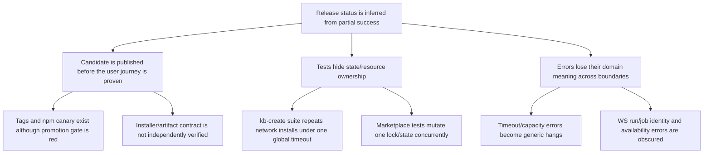

# Release operating system — audit and runbook

**Audit date:** 2026-08-13
**Scope:** npm platform + SDK releases, GitHub Actions, post-publish `kb-create` smoke, Playwright E2E history, and local release tooling.
**Decision:** **do not promote the current canaries.** Stabilize the post-publish smoke contour first, then cut a new candidate rather than declaring the existing tags released.

**Implemented with this audit:** the post-publish gate now runs a bounded isolated journey; first-install package discovery treats an empty platform as an empty inventory; marketplace scope mutations are serialized and tested; and WebSocket negative paths return classified errors. The remaining programme below is the release-system backlog, not a claim that every wave is complete.

## Executive state

| Surface | Current truth | Release meaning |
|---|---|---|
| npm `latest` | `@kb-labs/cli-bin` 2.117.0; `@kb-labs/sdk` 2.115.3 | These are the last verified stable releases. |
| npm `canary` | platform 2.118.2; SDK 2.115.4 | Candidates were delivered, but are **not verified stable releases**. |
| Last four candidate tags | `platform-v2.118.0`, `platform-v2.118.1`, `platform-v2.118.2`, `sdk-v2.115.4` | Every run completed `validate → stage → deliver candidate`; every run failed in post-publish `kb-create` smoke. |
| Dependency security | `pnpm audit`: 0 vulnerabilities across 1,916 dependencies | Green; retain as a release gate. |
| E2E Platform history | 45 success / 13 failure / 2 cancelled in the sampled 60 GitHub runs | Healthy enough to use as a signal, not proof of release readiness by itself. |

The key distinction is: **a tag or a package in npm is not a release.** A release becomes stable only after the exact candidate package set has passed user-facing smoke and has been promoted to `latest`.

## Incident ledger: what was already wrong

| Priority | Evidence | Impact | Systemic action |
|---|---|---|---|
| P0 | All four latest npm candidate runs delivered successfully but their `kb-create post-publish smoke` job failed. [2.118.0](https://github.com/kb-labs-team/kb-labs/actions/runs/31519310359), [2.118.1](https://github.com/kb-labs-team/kb-labs/actions/runs/31578936804), [2.118.2](https://github.com/kb-labs-team/kb-labs/actions/runs/31645997391), [SDK 2.115.4](https://github.com/kb-labs-team/kb-labs/actions/runs/31649195264). | Failed candidates remain available under `canary`; no later gate can make them eligible for `latest`. | Make candidate status visible and make promotion accept only a green run ID for the exact tag/commit. This exists conceptually; expose it in one release-status view. |
| P0 | Smoke is a serial Go E2E suite with a 35-minute suite timeout. It has timed out at different final tests: `TestDemoReviewSkipsUntrackedOnly`, `TestNoLLMByDefault`, and `TestServicesStartStop`. | A hang is diagnosed only after most of the budget is spent, with insufficient per-test/service evidence. | Split the smoke contour into bounded shards or give every lifecycle operation its own context deadline and diagnostic bundle. Upload process, port, config and service logs on timeout. |
| P0 | `pnpm install` from this checkout warns that e2e binaries for workflow/state cannot be linked until they are built. The unbuilt CLI also cannot run `pnpm kb`; after building it, platform startup falls back because `@kb-labs/data-store` is missing in root `node_modules`. | A clean developer/CI-like environment does not have an obvious supported path from install to operational CLI/E2E. This undermines reproduction. | Add one clean-bootstrap gate: fresh install → topological build → `kb` command discovery → selected E2E launcher. Fail with an actionable prerequisite, not an implicit fallback. |
| P1 | Marketplace tests `ML-01` and `MKT-03` had 8 failed final attempts and 8 retry recoveries each in the latest 10 flaky snapshots. Error signature: `apiRequestContext.post` timeout after 60s; category is currently `unknown`. | These are recurring failures, not harmless one-offs. A retry makes the job green while hiding a real availability/consistency problem. | Instrument marketplace install/list completion; classify this error as registry/consistency timeout; set an owner and SLO. Do not increase the blanket timeout first. |
| P1 | Workflow websocket cases `WS-L01`, `WS-L03`, `WS-P02` each failed three times; each closed with 1011 before the expected message. | Error paths for log/progress streams are unreliable and are not isolated from normal product releases. | Preserve server error and correlation ID in the client artifact; add a deterministic negative-path probe before the full browser run. |
| P1 | The historical tag workflows for 2.118.0/2.118.1 show inline promotion jobs; the checked-in workflow now uses a separate manual promotion workflow. | Run semantics depend on the workflow revision at tag time, making status hard to reason about retrospectively. | Version the release contract and write one immutable release receipt per tag: workflow SHA, artifact manifest hash, canary result, smoke result, promotion result, stable dist-tag verification. |
| P2 | The flaky reporter uses a small heuristic classifier; the dominant marketplace timeout is `unknown`. | Trend data exists but does not yet point cleanly to an owning subsystem. | Move error signatures and categories to a maintained taxonomy; review `unknown` weekly until it is below an agreed threshold. |

## The stable-release contract

Every release has one immutable **release receipt**. It is green only when all items are true for the same tag, SHA and manifest:

1. Source is on `main`; required CI and security gates are green.
2. `release-prepare` completed through its human approval, creating exactly one flow-specific tag.
3. CI stages the exact committed package versions once and saves the artifact manifest.
4. Candidate delivery succeeds, and every manifest package resolves at `@canary` to the expected version.
5. Post-publish smoke passes against those real `@canary` packages.
6. Manual promotion verifies the same candidate manifest, moves those versions to `latest`, and verifies the dist-tags.
7. Release receipt and rollback target are published; monitoring is clean for the defined observation window.

Anything earlier is a **candidate**, never “released”. Git tags, npm publication, and a green build are evidence, but none is a substitute for this receipt.

## Root-cause model and corrective programme

This is deliberately a system plan, not a list of timeout/retry changes. The recurring pattern is that an operation crosses several mutable boundaries (release artifact → registry → installer → workspace state → service/runtime), but completion is inferred from a local command exit or a timeout instead of an end-to-end invariant.

### Cause tree

### Confirmed technical causes

| Contour | Confirmed mechanism | Why symptom fixes fail | Correct invariant |
|---|---|---|---|
| Post-publish `kb-create` smoke | `tools/kb-create/Makefile` runs the complete network suite serially under one `go test -timeout 35m`. Many tests each create a new platform/project and execute `kb-create --yes`; the suite timeout kills whichever test happens to be last. Individual command deadline is 7 minutes, so the suite-level timer wins without a focused diagnosis. | Raising the job timeout only moves the random terminal test. Retrying reruns the same expensive, shared failure mode. | Every user-journey step has its own bounded deadline and diagnostic bundle; the release gate has a small deterministic smoke suite, while the exhaustive matrix is independently sharded. |
| Marketplace E2E | `ML-01` and `MKT-03` POST installations to the same platform root/marketplace state in concurrent Playwright workers. The spec explicitly acknowledges shared lock-file interference; install holds a network/package-manager operation for up to 60 seconds. | More retries, sleeps and a larger HTTP timeout conceal state contention and make CI non-deterministic. | A mutable marketplace scope has one serialized transaction owner, or every test receives an isolated scope. Install reports a durable operation/result ID and list observes that committed result. |
| Workflow WebSocket | Log endpoint path says `jobId` but reads a run; progress endpoint checks a job. Tests pass a run ID. Both existence checks use `catch(() => true)`, treating daemon unavailability as existence; uncaught downstream failures become a 1011 close. | A client-side retry cannot make an ambiguous resource identity or swallowed availability error correct. | Endpoint schemas name and validate one resource ID; daemon failure maps to a typed, observable error envelope, never a fake “exists” response or unexplained 1011. |
| Public install/release artifacts | The historical fresh-user incidents show independent version axes for launcher/binaries/npm packages and `workspace:*` leaking into published runtime dependencies. The release pipeline discovers the integration break only after publishing canary. | Fixing the currently broken version does not prevent the next package/binary/version skew. | A single release manifest binds tag SHA, npm tarball hashes, binary assets/checksums and installer resolver target; no candidate is deliverable unless that manifest validates. |
| Diagnosis and ownership | Process executor knows termination reason/usage, but downstream workflow reconstructs a plain `Error(message)`; evidence and retryability are lost. | Human log reading after a 35-minute timeout does not create a machine-enforced feedback loop. | `KBLabsError` crosses execution → workflow → REST → CLI/Studio with code, retryability, safe details, correlation ID and remediation hint. |

### Work in four waves

#### Wave 0 — contain and establish facts (now)

- Keep `latest` at platform 2.117.0 / SDK 2.115.3. Existing 2.118.x and SDK 2.115.4 remain failed candidates; do not re-label them as stable.
- Write a release receipt for each existing candidate with tag, SHA, manifest, `canary` result, smoke result and promotion status. This prevents ambiguity from historical workflow revisions.
- Freeze policy: a retry recovered test is evidence of a defect; it may not silently be used to justify a stable promotion.
- Attach the exact run IDs and flake timelines to ClickUp `869eapz3z`; no new ticket until the failure has an owner, boundary and acceptance test.

**Exit:** one authoritative view answers “what is stable, what is candidate, and why is it blocked?” without reading raw Actions logs.

#### Wave 1 — make artifacts and installation transactional

Build a reusable **public-artifact conformance gate** before candidate publication:

1. Produce one signed/hashed release manifest from the tagged source: package names/versions/tarball hashes, launcher version, binary asset names/checksums, expected dist-tags and source SHA.
2. Validate all packed `package.json` files: no `workspace:`, `link:` or local path in runtime-facing dependency fields; all internal versions are resolvable from the manifest.
3. In isolated temporary HOME/platform/project directories, run the official installer against the manifest, not an inferred “latest”. Verify binary download, checksum, Node/pnpm compatibility, `kb-create`, `kb`, `kb-dev` and generated manifests.
4. Make installation a two-phase transaction: plan/download/verify in staging; write install lock/config and success banner only after every required artifact and command is present. Failure must be non-zero, preserve the prior install, and emit a recovery hint.
5. Test at least Linux and macOS arm64/amd64 as the release matrix. The fast cross-platform contract runs before candidate delivery; the full journey runs against real `@canary` artifacts after delivery.

**Do not:** add a fallback to an older binary, silently omit a binary, or accept an HTTP 404 as a partial success.

**Exit:** a candidate cannot be published if its manifest cannot create a working clean install; a clean installation cannot claim success without all mandatory artifacts.

#### Wave 2 — redesign release validation by risk and isolation

Split one overloaded 35-minute smoke into three named, independently diagnosable gates:

| Gate | Purpose | Isolation and budget | Promotion rule |
|---|---|---|---|
| Artifact conformance | Pack/install/dependency/binary contract | No shared HOME/platform; short bounded probes | Must pass before candidate delivery. |
| Candidate core journey | install → `kb`/`kb-dev` → start/status → marketplace command → workflow status | One test fixture per journey; each command deadline; collect diagnostic dossier | Must pass for promotion. |
| Exhaustive journey matrix | Update, uninstall, scaffold, demos, auth variants, full templates and regressions | Sharded by independent temporary roots/OS; never shares a mutable installation | Required before release-train close; failures block the affected feature contour. |

The current Go suite should use a fixture factory that builds/downloads once per shard where safe, but each test gets an isolated `HOME`, platform dir, project dir, ports and registry namespace. Each command receives a context deadline shorter than the shard deadline. On failure, upload: command, exit code, stdout/stderr, environment-safe config, process tree, open ports, service logs, manifest and lock state.

**Exit:** a failure names the step and boundary in minutes, not merely the last test alive at a global timeout.

#### Wave 3 — make mutable operations and errors explicit

**Marketplace transaction boundary**

- Give install/update/uninstall one scope-level transaction lock (or route each E2E test to a separate scope). Return operation ID and terminal state.
- Commit lock/manifests atomically after package-manager success; expose `GET operation`/durable listing only after commit.
- Tests await operation completion rather than sleeping/retrying `GET /packages`. Parallel tests must prove they either serialize or cannot observe each other.

**Workflow WebSocket boundary**

- Rename paths/payloads to `runId` or `jobId` according to the actual daemon contract; reject mismatches at the gateway with a typed error.
- Replace `catch(() => true)` with an explicit unavailable error. A 404 gives a domain `NOT_FOUND`; 5xx/network gives `DEPENDENCY_UNAVAILABLE`; neither is a false success.
- Preserve `KBLabsError` fields from governed execution through workflow persistence, REST and Studio. Use the same envelope in WebSocket error messages and diagnostic artifacts.

**Exit:** no test waits for incidental eventual consistency, and no runtime error is converted into an opaque socket close or generic stack trace.

### Non-regression gates and operating metrics

| Metric / gate | Target | Escalation |
|---|---|---|
| Candidate-to-promotion rate | 100% only for candidates with green receipts; failed candidates never promoted | Any mismatch is P0 release-process incident. |
| Core journey duration | A defined per-step budget with 20% headroom; report percentile by step rather than suite total | Breach creates performance/reliability work, not a timeout increase. |
| Flake rate by case and category | 0% for release-blocking journeys; P1 below 2% in trailing 10 runs | Two release windows or three repeated signatures blocks promotion until owned. |
| Unknown flake category | Monotonically decreases; every recurring signature classified | Weekly triage; cannot remain `unknown` after three occurrences. |
| Transaction integrity | Zero false-success installs; zero partial lock/config commits | P0; preserve before/after state in test artifact. |
| Diagnostic completeness | 100% of timed-out/failed critical runs have correlation ID plus dossier | Missing evidence is a test-infrastructure defect. |

## Operating checklists

### Before cutting a candidate

- [ ] `main` is checked out, clean and remote CI is green; no detached-worktree release.
- [ ] The release flow is named explicitly: `platform` or `sdk`; platform goes before SDK.
- [ ] Read the previous release receipt and all open P0/P1 incidents.
- [ ] `pnpm audit --json` has no unaccepted high/critical findings.
- [ ] Clean-bootstrap probe is green: frozen install, topological build, CLI discovery, selected E2E launcher.
- [ ] Flake policy passes: no P0 known flake, no unowned P1, and no new `unknown` signature.
- [ ] A rollback choice is explicit: previous `latest` version and the action that will halt promotion.

### Cut the candidate

- [ ] Start only `pnpm kb workflow run --workflow-id release-prepare --input '{"flow":"platform"}'` (or `sdk`).
- [ ] Inspect plan, package count, changelog, checks, and release-review artifacts.
- [ ] Obtain explicit human approval at the workflow approval gate.
- [ ] Record tag, SHA, workflow run and artifact-manifest hash in the receipt.
- [ ] Watch CI: source validation → stage → candidate delivery → post-publish smoke.

### Candidate verification and promotion

- [ ] Confirm every package in the manifest is the expected version at `@canary`.
- [ ] Smoke run is green and its artifacts show no timeout, orphan process, or unclassified fatal error.
- [ ] Verify the candidate run ID is tied to the release tag SHA.
- [ ] Trigger promotion with that exact tag and successful candidate run ID.
- [ ] Verify `latest` for a representative executable package, a core package, and SDK where applicable.
- [ ] Publish the release receipt and start the observation window.

### Stop / rollback rules

- [ ] **Stop promotion** on any failed smoke, unexplained retry in a release-critical test, missing artifact, or tag/SHA/manifest mismatch.
- [ ] Never delete or retag a release tag to “make CI retry”. Diagnose and rerun the failed CI job only when its operation is documented idempotent.
- [ ] A failed candidate stays a failed candidate; do not use it as the next release baseline.
- [ ] If `latest` was promoted and a user-impacting defect is confirmed, first halt promotion, then publish a forward fix or move the dist-tag only under an explicit incident decision; record both actions in the receipt.

## Reliability policy for E2E

Use the `ci-data` history as a product signal, not a decorative report.

| Tier | Rule | Action |
|---|---|---|
| Release-blocking | Any failure in post-publish smoke, or a reproducible failure in an installer/core user journey | Block promotion; incident owner required. |
| P0 flake | Same test retries or fails in two consecutive release windows, or affects install/auth/data integrity | Quarantine only with CTO decision; a remediation task and expiry are required. |
| P1 flake | Flip rate over the recent 10-run window above 2%, or three occurrences of one signature | Assign subsystem owner; fix/instrument before the next release train. |
| Observation | One isolated retry with known transient external cause | Keep evidence and track; no automatic timeout increase. |

Daily/weekly hygiene:

- Run `pnpm kb qa e2e-flaky --sync --agent` in the CI environment after the QA plugin is built.
- Publish top cases, new signatures, final failures, retry recoveries, and `unknown` category share.
- A retry counts as a reliability defect even when the job exits green.
- Attach run ID, test ID, correlation ID, service logs and retry history to the ticket; never create a ticket that only says “flaky”.

## Next release plan

1. **Unblock the actual release gate:** reproduce and split/instrument `kb-create` post-publish smoke. A full-suite 35-minute timeout is not a valid diagnosis. Start with the lifecycle/daemon path shared by the three observed terminal tests.
2. **Make failed-candidate state explicit:** build a `release status <tag>` receipt view and mark 2.118.0–2.118.2/SDK 2.115.4 as *candidate failed; not promotable*. Do not rescue them by promotion.
3. **Fix the two marketplace timeout cases as a single consistency contour:** correlate install completion, registry persistence, and list visibility; replace blind retry with a domain-ready condition and diagnostics.
4. **Fix WebSocket negative paths:** return/record the intended error rather than a 1011 close; ship server-side diagnostics with the E2E artifact.
5. **Close clean-bootstrap debt:** codify install/build/CLI/plugin discovery as one verified path, including the missing data-store adapter and required service binary outputs.
6. Only then run a new platform candidate through the normal `release-prepare` workflow; promote it only when the receipt is fully green. Release SDK afterwards if it has its own green candidate receipt.

## ClickUp alignment: one critical path, not a new backlog

The audit is already substantially represented in ClickUp. The immediate mistake to avoid is treating these as independent tickets: together they define one release-critical user journey, **official install → usable platform → marketplace/plugin → workflow → release verification**.

| Order | Existing task | Role in the release system | Exit evidence |
|---|---|---|---|
| 1 | [P0/P1 release flow + mandatory E2E](https://app.clickup.com/t/869eapz3z) | Parent release-blocker. Its acceptance criteria already cover installer, failure semantics, auth propagation, templates, scaffold, services and release smoke against public artifacts. | Public-registry journey is green on macOS arm64/amd64 and Linux; false success and missing artifacts fail non-zero. |
| 2 | [Critical fresh-user install](https://app.clickup.com/t/869ec29gw) | Fixes the first gate: public packages must not leak `workspace:*`, and installer/launcher/platform versions must resolve coherently. | Clean HOME install reaches `kb --help`, `kb-dev`, services and a real plugin command. |
| 3 | [Full install → first plugin/demo](https://app.clickup.com/t/869daucfv) | Defines the user-facing acceptance test for the product, including the five-minute target and useful hints. | Reusable artifact-backed test, not a manual demo checklist. |
| 4 | [Marketplace install](https://app.clickup.com/t/869dauekd) and [update/rollback](https://app.clickup.com/t/869dauekj) | Covers the consistency/atomicity contour implicated by `ML-01` and `MKT-03`. | Install/list visibility, dependency resolution, failure rollback and update rollback are deterministic. |
| 5 | [Structured workflow errors](https://app.clickup.com/t/869efn8nw) | Supplies the missing diagnosis layer for workflow/release timeouts and capacity failures. | Error code, retryability, limits and correlation evidence survive execution → workflow → REST → Studio. |
| 6 | [Agent takes a ClickUp task](https://app.clickup.com/t/869daud6y) | A later end-to-end system check; it should not enter the release critical path until tasks 1–5 are green. | The agent can safely select, execute and recover a task without ambiguous state. |

Recommended status model for the release-critical tasks:

- `blocked by release gate` — not eligible for candidate/promotion;
- `in verification` — fix merged, public-artifact journey running;
- `verified` — linked release receipt is green;
- `accepted risk` — requires an owner, expiry and explicit decision; never silently becomes “done”.

Do not create duplicate flake tickets yet. First attach the current evidence (`ML-01`, `MKT-03`, `WS-L01`, `WS-L03`, `WS-P02`, candidate run IDs) to task `869eapz3z`; split only when each case has an independently testable owner and acceptance criterion.

## Audit evidence

- Latest candidate runs: [platform 2.118.0](https://github.com/kb-labs-team/kb-labs/actions/runs/31519310359), [2.118.1](https://github.com/kb-labs-team/kb-labs/actions/runs/31578936804), [2.118.2](https://github.com/kb-labs-team/kb-labs/actions/runs/31645997391), [SDK 2.115.4](https://github.com/kb-labs-team/kb-labs/actions/runs/31649195264).
- E2E history: `origin/ci-data:.kb/qa/snapshots/e2e-flaky.json` (23 snapshots; audit window uses the last 10).
- Flaky tests: `e2e/marketplace/scenarios/default/cases/lifecycle.spec.ts`, `e2e/marketplace/scenarios/default/cases/packages.spec.ts`, `e2e/workflows/scenarios/default/cases/ws/`.
- Post-publish smoke: `tools/kb-create/e2e/e2e_test.go`.
- Release orchestration: `.kb/workflows/release-prepare.yml`, `.kb/workflows/release-promote.yml`, `.github/workflows/release-build-candidate.yml`, `.github/workflows/release-deliver-candidate.yml`.
